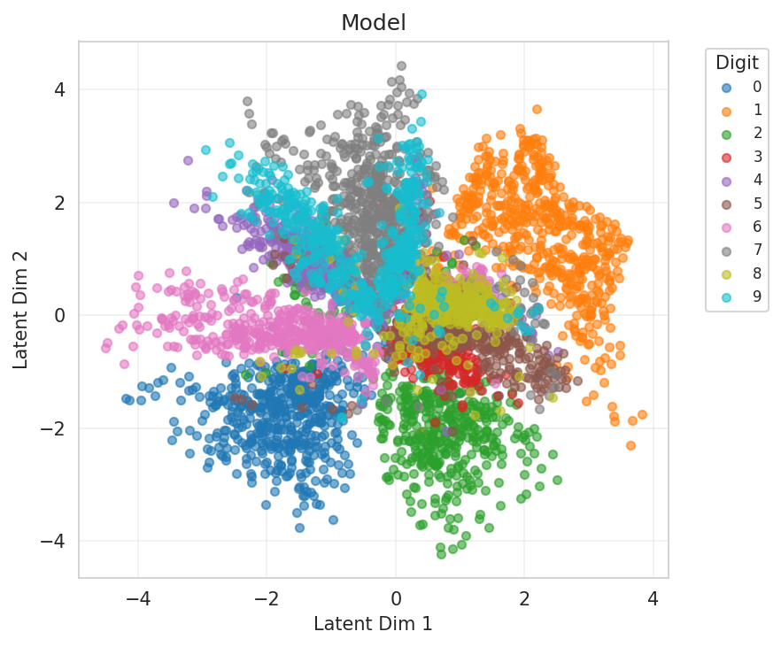

# Experiment Report

**Experiment:** mixture_entropy_reward_100labels

**Description:** Negative usage sparsity with 100 labeled samples

**Tags:** ablation, entropy-reward, 100-labels

**Generated:** 20251109_004339

## Configuration

### Data

- num_samples: 5000
- num_labeled: 100
- seed: 42

### Model

- Prior: mixture
- Latent dim: 2
- Hidden dims: (256, 128, 64)
- Components (K): 10
- Reconstruction loss: bce
- Learning rate: 0.001
- Batch size: 128
- Max epochs: 100

## Results

### Summary Metrics

| Category | Metric | Value |
|----------|--------|-------|
| Training | Loss | 221.1740 |
| Training | Recon Loss | 125.1163 |
| Training | Kl Z | 3.8014 |
| Training | Kl C | 0.0021 |
| Training | Training Time Sec | 189.7708 |
| Training | Epochs Completed | 100 |
| Classification | Accuracy | 0.6150 |
| Classification | Classification Loss | 0.2444 |
| Mixture | K | 10 |
| Mixture | Component Entropy | 0.2519 |
| Mixture | Pi Entropy | 2.3026 |
| Mixture | K Eff | 6.7196 |
| Mixture | Active Components | 9 |
| Mixture | Responsibility Confidence Mean | 0.8671 |
| Mixture | Component Majority Labels | [9, 5, 6, 7, 7, 6, 5, 6, 6, 6] |
| Mixture | Component Majority Confidence | [0.3455328047275543, 0.2685396671295166, 0.838446319103241, 0.2568908929824829, 0.40450313687324524, 0.9239798188209534, 0.7789479494094849, 0.8672324419021606, 0.9616007208824158, 0.8168390989303589] |
| Mixture | Pi Max | 0.1000 |
| Mixture | Pi Min | 0.1000 |
| Mixture | Pi Argmax | 4 |
| Clustering | NMI | 0.5365 |
| Clustering | ARI | -0.0964 |

## Visualizations

### Loss Curves

### Latent Space

**By Class Label:**

**By Component Assignment:**

### Responsibility Confidence

Distribution of max_c q(c|x):

### Reconstructions

### Mixture Evolution

