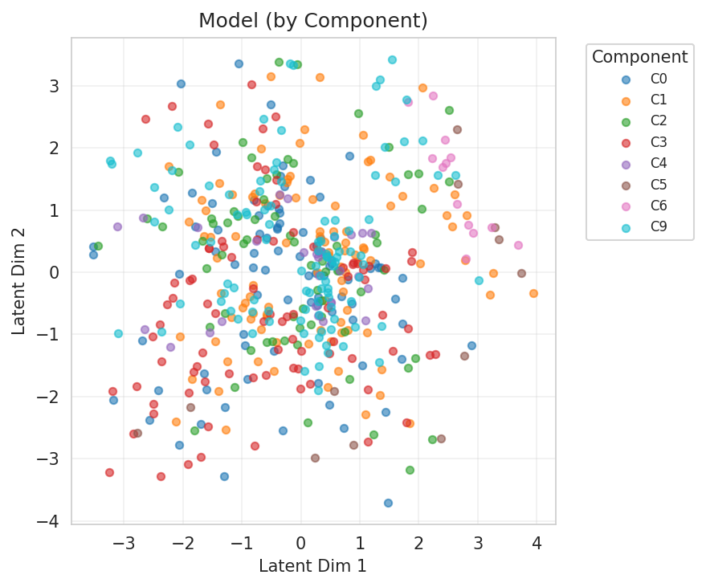
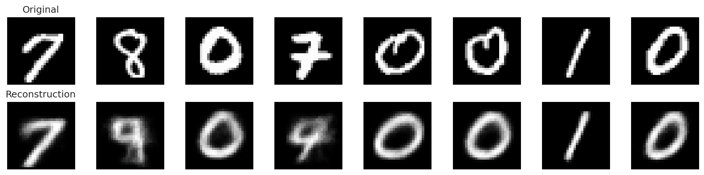
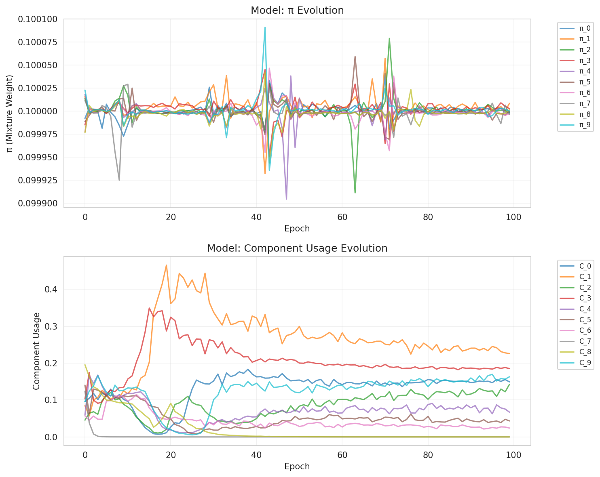

# Experiment Report

**Experiment:** mixture_ablation_entropy_reward

**Description:** Mild KL_c with Dirichlet alpha=5 and negative usage_sparsity_weight to encourage spread

**Tags:** ablation, parsimony, entropy-reward

**Generated:** 20251109_003609

## Configuration

### Data

- num_samples: 5000
- num_labeled: 50
- seed: 42

### Model

- Prior: mixture
- Latent dim: 2
- Hidden dims: (256, 128, 64)
- Components (K): 10
- Reconstruction loss: bce
- Learning rate: 0.001
- Batch size: 128
- Max epochs: 100

## Results

### Summary Metrics

| Category | Metric | Value |
|----------|--------|-------|
| Training | Loss | 221.5295 |
| Training | Recon Loss | 125.5540 |
| Training | Kl Z | 3.7749 |
| Training | Kl C | 0.0020 |
| Training | Training Time Sec | 185.4705 |
| Training | Epochs Completed | 100 |
| Classification | Accuracy | 0.4798 |
| Classification | Classification Loss | 0.1897 |
| Mixture | K | 10 |
| Mixture | Component Entropy | 0.3341 |
| Mixture | Pi Entropy | 2.3026 |
| Mixture | K Eff | 6.8114 |
| Mixture | Active Components | 8 |
| Mixture | Responsibility Confidence Mean | 0.8434 |
| Mixture | Component Majority Labels | [8, 0, 7, 9, 6, 6, 7, 7, 7, 6] |
| Mixture | Component Majority Confidence | [0.5160504579544067, 0.4385547339916229, 0.9879128336906433, 0.9924807548522949, 0.8121823072433472, 0.9998709559440613, 0.5229988694190979, 9.266465212931507e-07, 0.8960716128349304, 0.9998578429222107] |
| Mixture | Pi Max | 0.1000 |
| Mixture | Pi Min | 0.1000 |
| Mixture | Pi Argmax | 1 |
| Clustering | NMI | 0.8520 |
| Clustering | ARI | 0.0000 |

## Visualizations

### Loss Curves

### Latent Space

**By Class Label:**

**By Component Assignment:**

### Responsibility Confidence

Distribution of max_c q(c|x):

### Reconstructions

### Mixture Evolution

