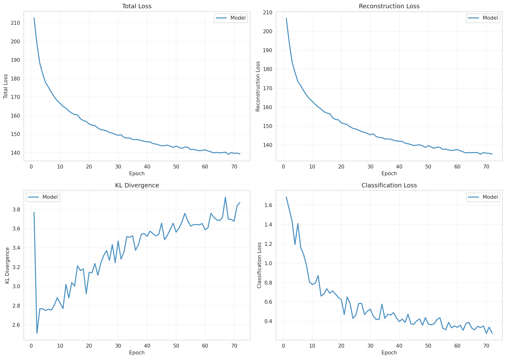
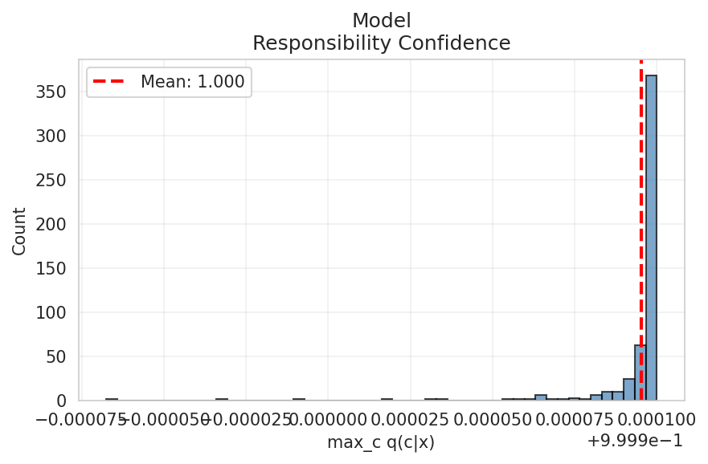
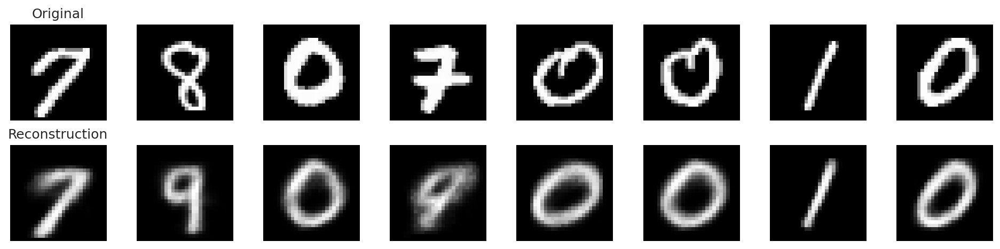

# Experiment Report

**Experiment:** mixture_k10_50labels

**Description:** Mixture prior with 50 labeled samples (5k total)

**Tags:** mixture, baseline, 5k

**Generated:** 20251108_234440

## Configuration

### Data

- num_samples: 5000
- num_labeled: 50
- seed: 42

### Model

- Prior: mixture
- Latent dim: 2
- Hidden dims: (256, 128, 64)
- Components (K): 10
- Reconstruction loss: bce
- Learning rate: 0.001
- Batch size: 128
- Max epochs: 100

## Results

### Summary Metrics

| Category | Metric | Value |
|----------|--------|-------|
| Training | Loss | 139.3479 |
| Training | Recon Loss | 135.1992 |
| Training | Kl Z | 3.8712 |
| Training | Kl C | 0.0001 |
| Training | Training Time Sec | 136.7464 |
| Training | Epochs Completed | 72 |
| Classification | Accuracy | 0.5110 |
| Classification | Classification Loss | 0.2773 |
| Mixture | K | 10 |
| Mixture | Component Entropy | 0.0000 |
| Mixture | Pi Entropy | 1.1144 |
| Mixture | K Eff | 1.0001 |
| Mixture | Active Components | 1 |
| Mixture | Responsibility Confidence Mean | 1.0000 |
| Mixture | Pi Max | 0.7478 |
| Mixture | Pi Min | 0.0247 |
| Mixture | Pi Argmax | 0 |
| Clustering | NMI | 0.0000 |
| Clustering | ARI | 0.0000 |

## Visualizations

### Loss Curves

### Latent Space

**By Class Label:**

**By Component Assignment:**

### Responsibility Confidence

Distribution of max_c q(c|x):

### Reconstructions

### Mixture Evolution

