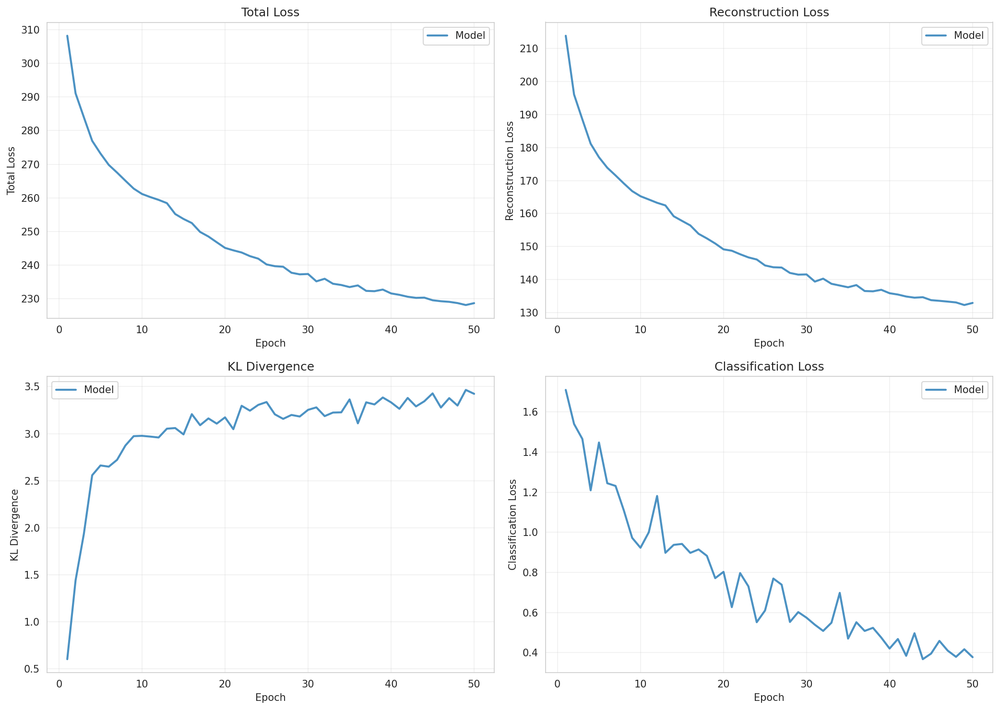
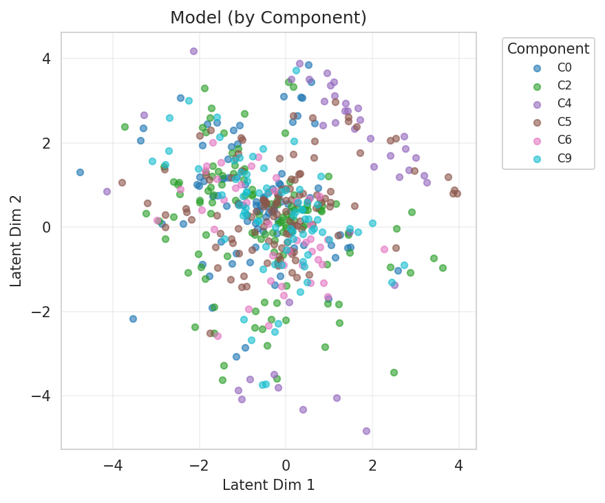
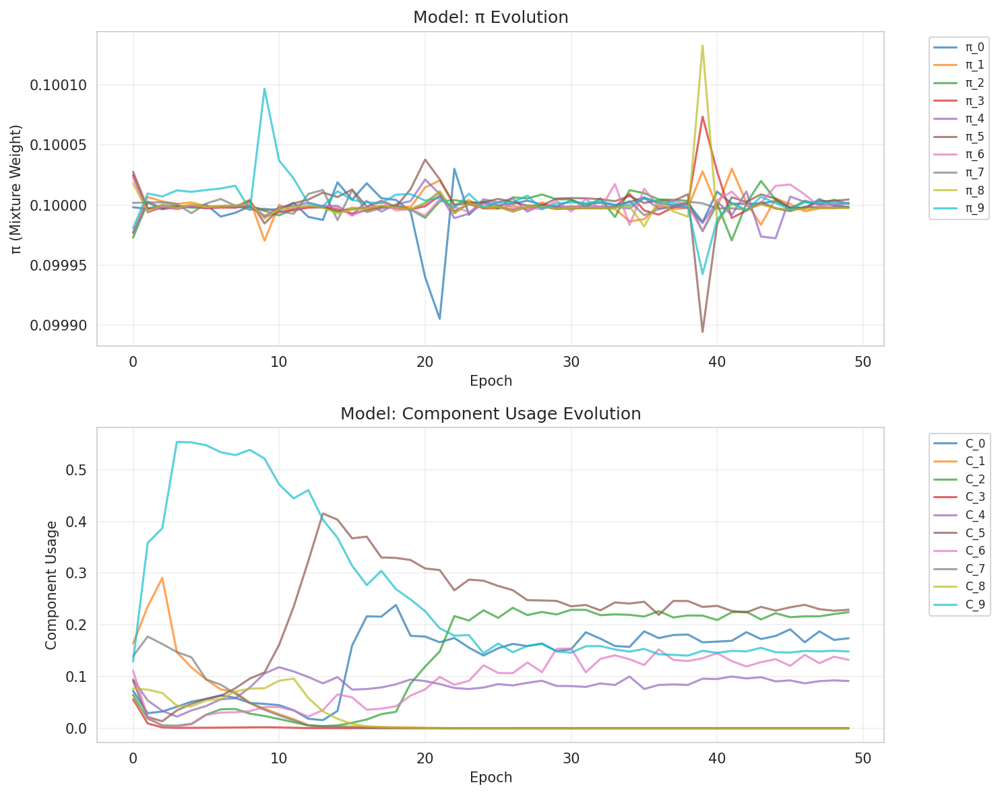
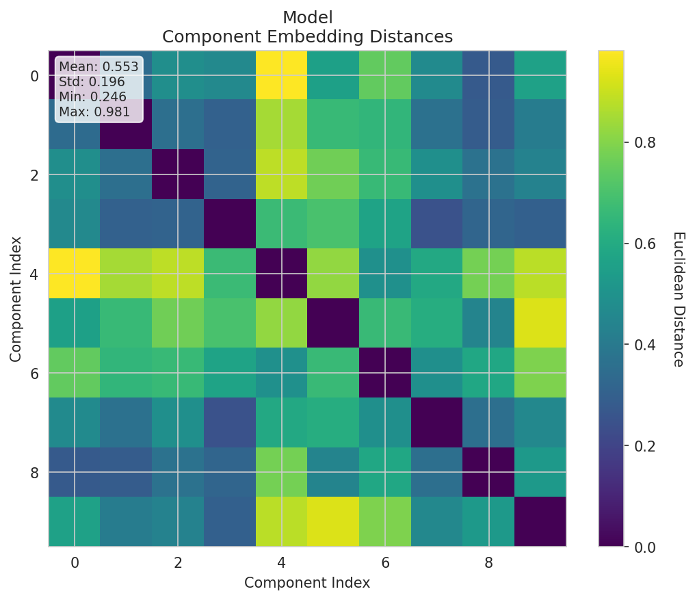
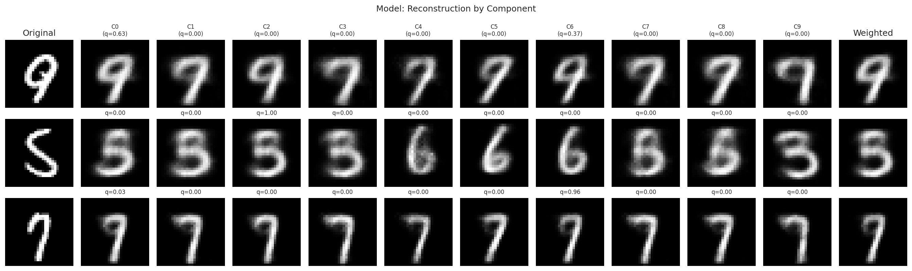

# Experiment Report

**Experiment:** mixture_k10

**Description:** Mixture VAE with K=10 components, usage sparsity, and full tracking

**Tags:** mixture, k10, 2d-latent

**Generated:** 20251109_131455

## Configuration

### Data

- num_samples: 5000
- num_labeled: 50
- seed: 42

### Model

- Prior: mixture
- Latent dim: 2
- Hidden dims: (256, 128, 64)
- Components (K): 10
- Reconstruction loss: bce
- Learning rate: 0.001
- Batch size: 128
- Max epochs: 50

## Results

### Summary Metrics

| Category | Metric | Value |
|----------|--------|-------|
| Training | Loss | 228.7344 |
| Training | Recon Loss | 132.9170 |
| Training | Kl Z | 3.4210 |
| Training | Kl C | 0.0022 |
| Training | Training Time Sec | 31.4244 |
| Training | Epochs Completed | 50 |
| Classification | Accuracy | 0.4496 |
| Classification | Classification Loss | 0.3772 |
| Mixture | K | 10 |
| Mixture | Component Entropy | 0.1306 |
| Mixture | Pi Entropy | 2.3026 |
| Mixture | K Eff | 5.6012 |
| Mixture | Active Components | 6 |
| Mixture | Responsibility Confidence Mean | 0.9233 |
| Mixture | Component Majority Labels | [1, 1, 8, 1, 0, 6, 0, 1, 1, 9] |
| Mixture | Component Majority Confidence | [0.8547139167785645, 0.6605291962623596, 0.9398654699325562, 0.09515176713466644, 0.9777159094810486, 0.9958661198616028, 0.9858955144882202, 0.9477481245994568, 0.9854381084442139, 0.5135453939437866] |
| Mixture | Pi Max | 0.1000 |
| Mixture | Pi Min | 0.1000 |
| Mixture | Pi Argmax | 5 |
| Clustering | NMI | 0.9311 |
| Clustering | ARI | 0.0000 |

## Visualizations

### Loss Curves

### Latent Space

**By Class Label:**

**By Component Assignment:**

### Responsibility Confidence

Distribution of max_c q(c|x):

### Reconstructions

### Mixture Evolution

### Component Embedding Divergence

Pairwise distances between learned component embeddings:

### Reconstruction by Component

How each component reconstructs individual inputs:

