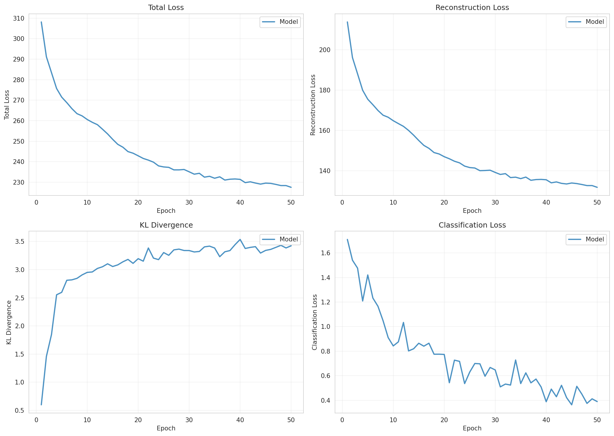
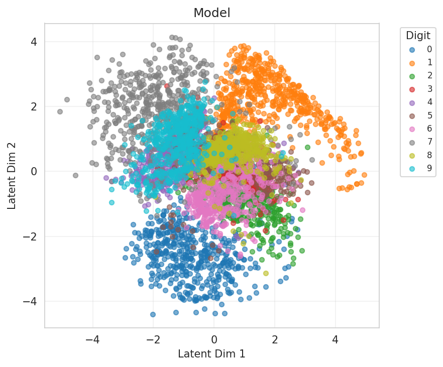
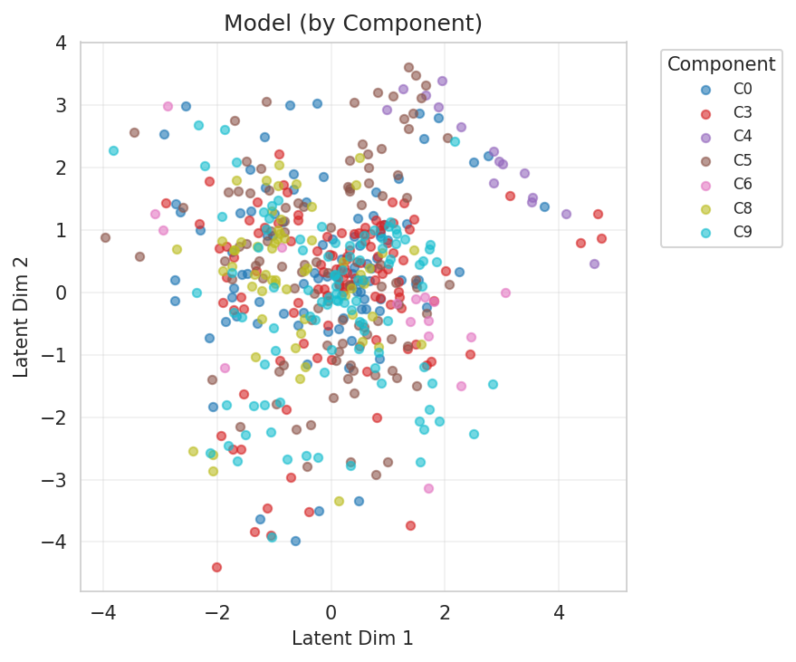
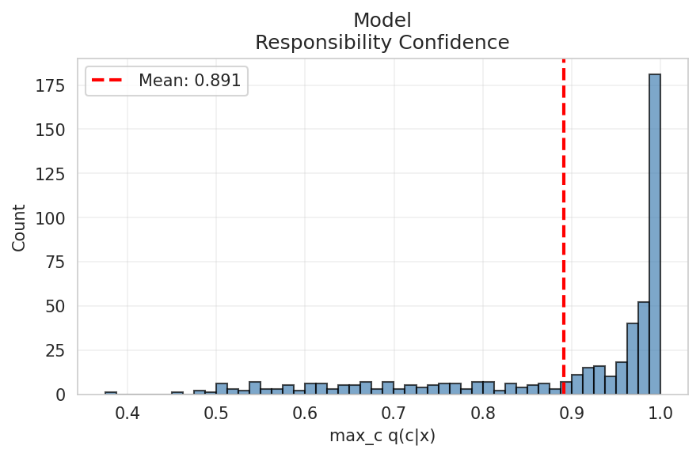
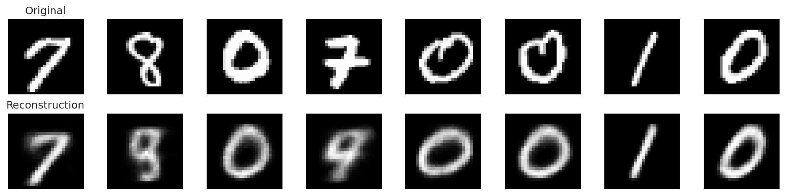
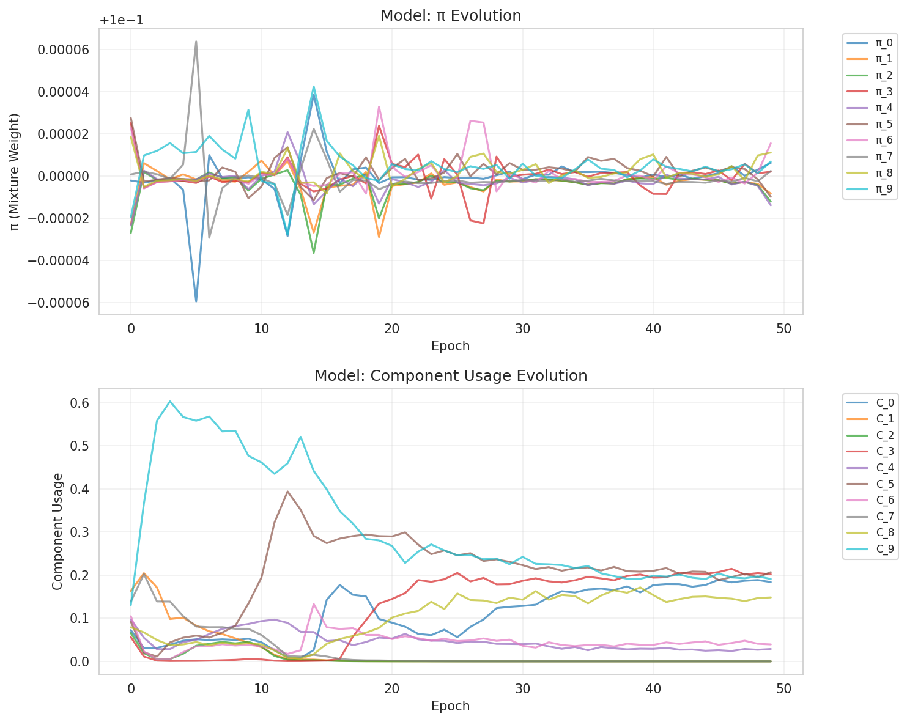
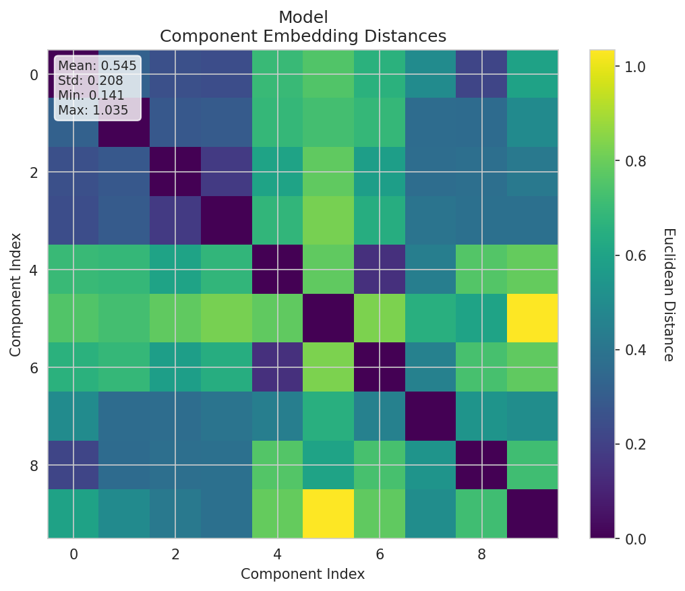
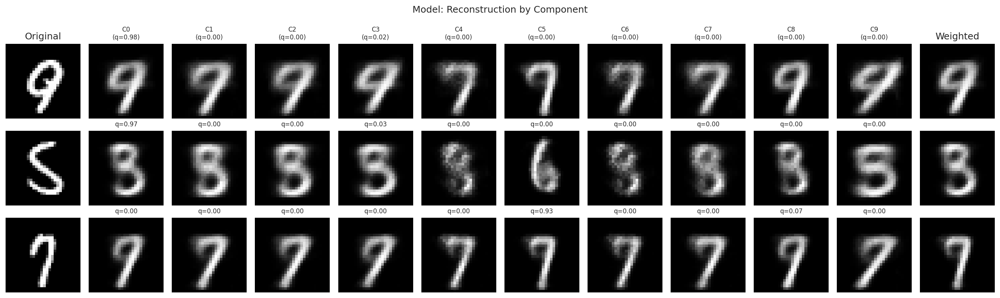

# Experiment Report

**Experiment:** mixture_k10

**Description:** Mixture VAE with K=10 components, usage sparsity, and full tracking

**Tags:** mixture, k10, 2d-latent

**Generated:** 20251109_153043

## Configuration

### Data

- num_samples: 5000
- num_labeled: 50
- seed: 42

### Model

- Prior: mixture
- Latent dim: 2
- Hidden dims: (256, 128, 64)
- Components (K): 10
- Reconstruction loss: bce
- Learning rate: 0.001
- Batch size: 128
- Max epochs: 50

## Results

### Summary Metrics

| Category | Metric | Value |
|----------|--------|-------|
| Training | Loss | 227.5395 |
| Training | Recon Loss | 131.7106 |
| Training | Kl Z | 3.4221 |
| Training | Kl C | 0.0021 |
| Training | Training Time Sec | 31.1246 |
| Training | Epochs Completed | 50 |
| Classification | Accuracy | 0.3920 |
| Classification | Classification Loss | 0.3898 |
| Mixture | K | 10 |
| Mixture | Component Entropy | 0.1941 |
| Mixture | Pi Entropy | 2.3026 |
| Mixture | K Eff | 5.8700 |
| Mixture | Active Components | 7 |
| Mixture | Responsibility Confidence Mean | 0.8910 |
| Mixture | Component Majority Labels | [9, 9, 9, 8, 7, 0, 7, 9, 7, 8] |
| Mixture | Component Majority Confidence | [0.9981808066368103, 0.0029005089309066534, 0.002584193367511034, 0.999280571937561, 0.4963778555393219, 0.4493890106678009, 0.8278138637542725, 0.8102626204490662, 0.5043697953224182, 1.0] |
| Mixture | Pi Max | 0.1000 |
| Mixture | Pi Min | 0.1000 |
| Mixture | Pi Argmax | 6 |
| Clustering | NMI | 0.8520 |
| Clustering | ARI | 0.0000 |

## Visualizations

### Loss Curves

### Latent Space

**By Class Label:**

**By Component Assignment:**

### Responsibility Confidence

Distribution of max_c q(c|x):

### Reconstructions

### Mixture Evolution

### Component Embedding Divergence

Pairwise distances between learned component embeddings:

### Reconstruction by Component

How each component reconstructs individual inputs:

