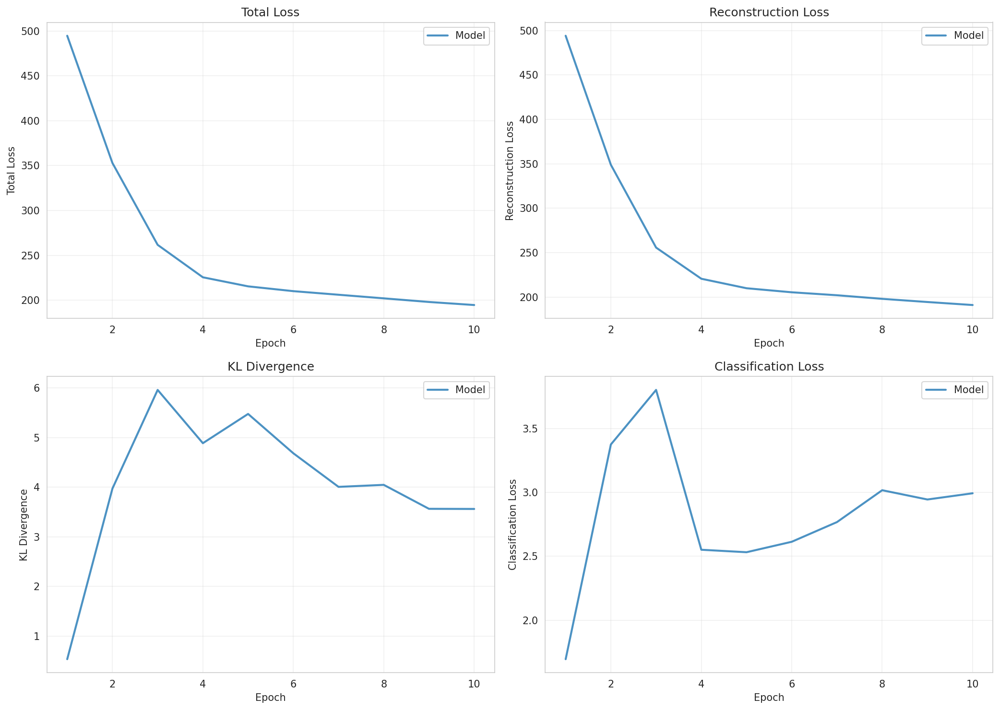
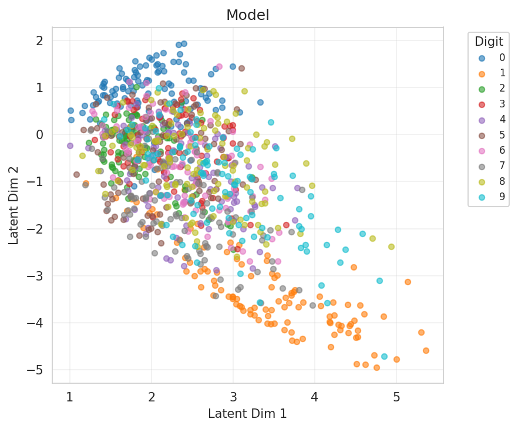
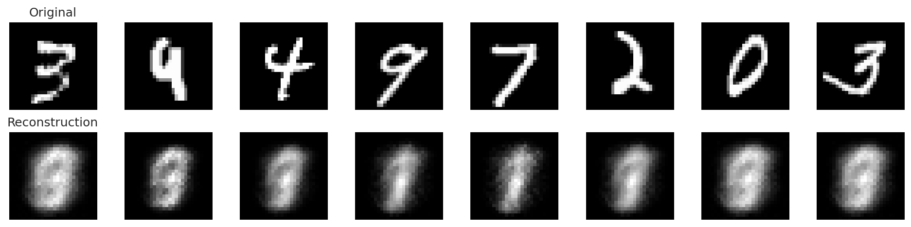

# Experiment Report

**Experiment:** quick_test

**Description:** Quick sanity check with minimal training

**Tags:** test, quick

**Generated:** 20251110_165557

## Configuration

### Data

- num_samples: 1000
- num_labeled: 20
- seed: 42

### Model

- Prior: standard
- Latent dim: 2
- Hidden dims: (128, 64)
- Reconstruction loss: bce
- Learning rate: 0.001
- Batch size: 128
- Max epochs: 10

## Results

### Summary Metrics

| Category | Metric | Value |
|----------|--------|-------|
| Training | Loss | 194.7177 |
| Training | Recon Loss | 191.1560 |
| Training | Kl Z | 3.5617 |
| Training | Kl C | 0.0000 |
| Training | Training Time Sec | 10.1616 |
| Training | Epochs Completed | 10 |
| Classification | Accuracy | 0.0530 |
| Classification | Classification Loss | 2.9925 |

## Visualizations

### Loss Curves

### Latent Space

**By Class Label:**

### Reconstructions

