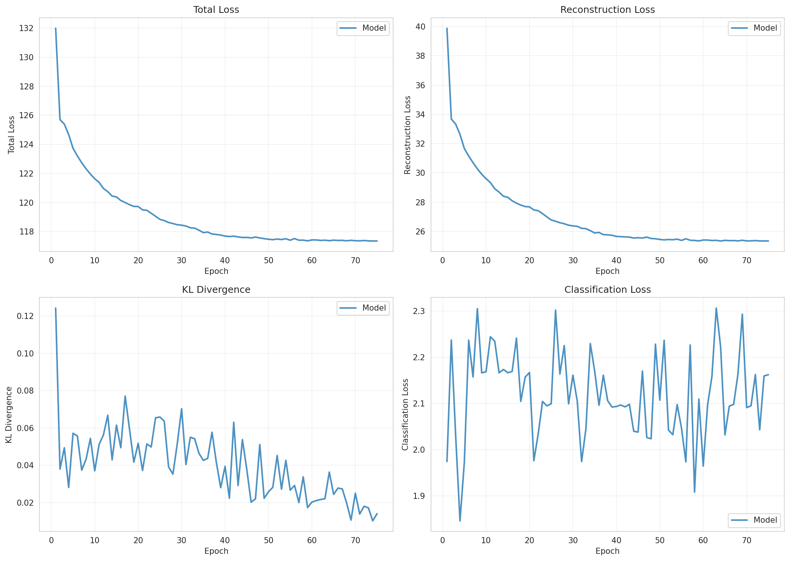
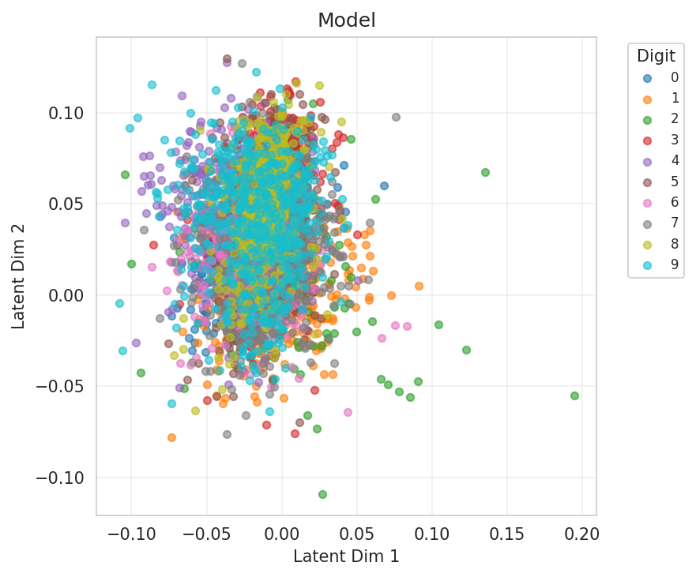
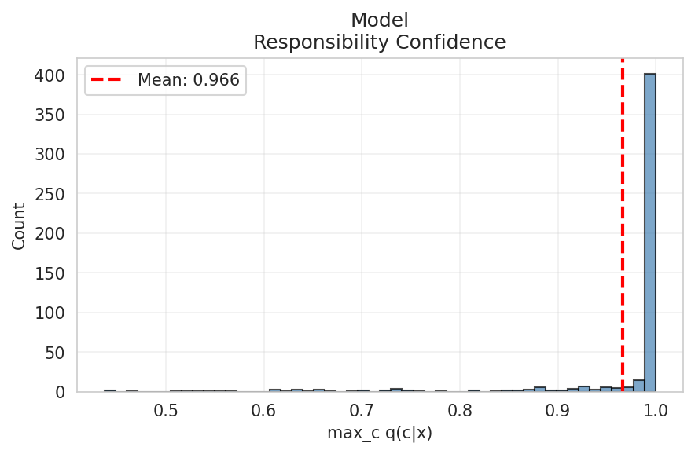
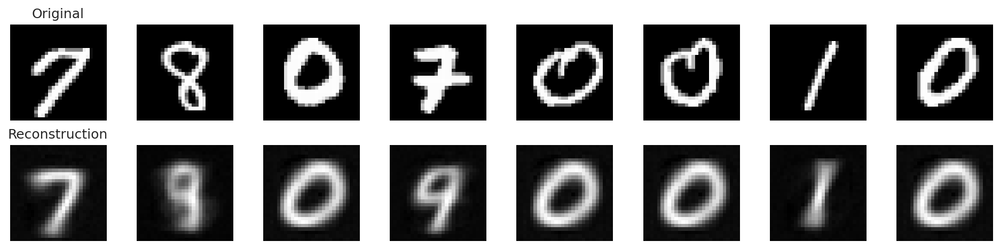
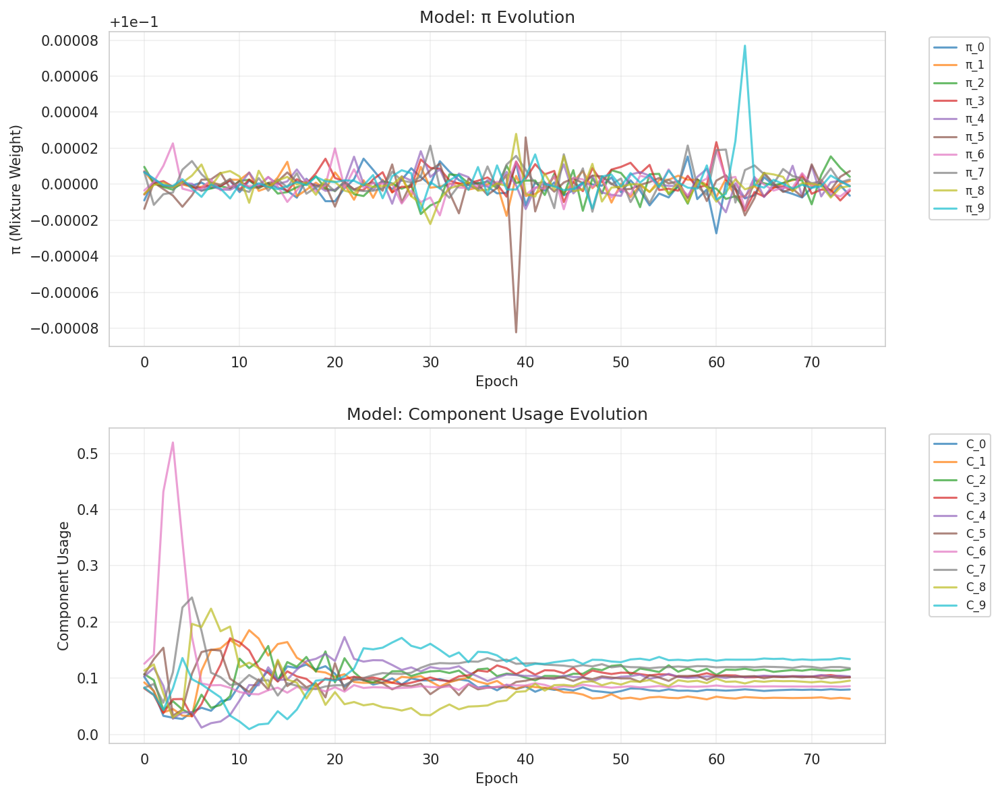
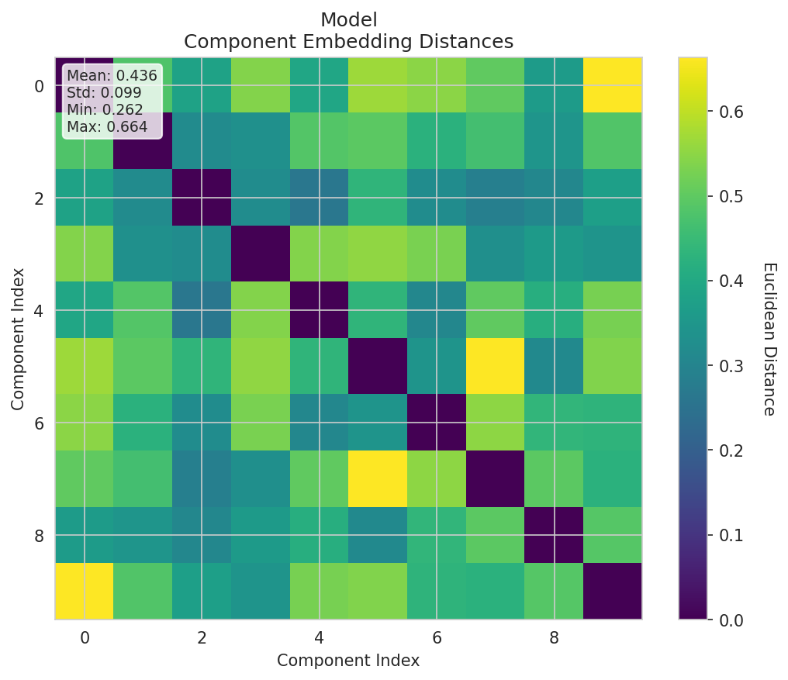
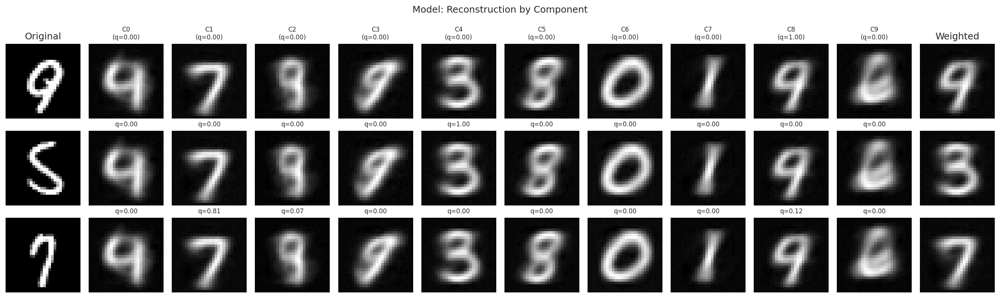

# Experiment Report

**Experiment:** tau_classifier_ablation_baseline

**Description:** Baseline: component-aware decoder WITHOUT τ-classifier (standard head)

**Tags:** ablation, baseline, component-aware

**Generated:** 20251110_112156

## Configuration

### Data

- dataset: mnist
- num_samples: 5000
- num_labeled: 100
- seed: 42

### Model

- Prior: mixture
- Latent dim: 2
- Hidden dims: (256, 128, 64)
- Components (K): 10
- Reconstruction loss: mse
- Learning rate: 0.001
- Batch size: 128
- Max epochs: 300

## Results

### Summary Metrics

| Category | Metric | Value |
|----------|--------|-------|
| Training | Loss | 117.3493 |
| Training | Recon Loss | 25.3441 |
| Training | Kl Z | 0.0119 |
| Training | Kl C | 0.0023 |
| Training | Training Time Sec | 35.6317 |
| Training | Epochs Completed | 75 |
| Classification | Accuracy | 0.1022 |
| Classification | Classification Loss | 2.1622 |
| Mixture | K | 10 |
| Mixture | Component Entropy | 0.0204 |
| Mixture | Pi Entropy | 2.3026 |
| Mixture | K Eff | 9.7678 |
| Mixture | Active Components | 10 |
| Mixture | Responsibility Confidence Mean | 0.9659 |
| Mixture | Component Majority Labels | [9, 7, 4, 5, 3, 8, 0, 1, 4, 6] |
| Mixture | Component Majority Confidence | [0.3371043801307678, 0.9999954104423523, 0.7775812745094299, 0.3629816174507141, 0.5000633001327515, 0.9999374151229858, 0.9999850988388062, 0.9995822906494141, 0.527678906917572, 0.9266015887260437] |
| Mixture | Pi Max | 0.1000 |
| Mixture | Pi Min | 0.1000 |
| Mixture | Pi Argmax | 5 |
| Clustering | NMI | 0.7552 |
| Clustering | ARI | 0.0695 |

## Visualizations

### Loss Curves

### Latent Space

**By Class Label:**

**By Component Assignment:**

### Responsibility Confidence

Distribution of max_c q(c|x):

### Reconstructions

### Mixture Evolution

### Component Embedding Divergence

Pairwise distances between learned component embeddings:

### Reconstruction by Component

How each component reconstructs individual inputs:

