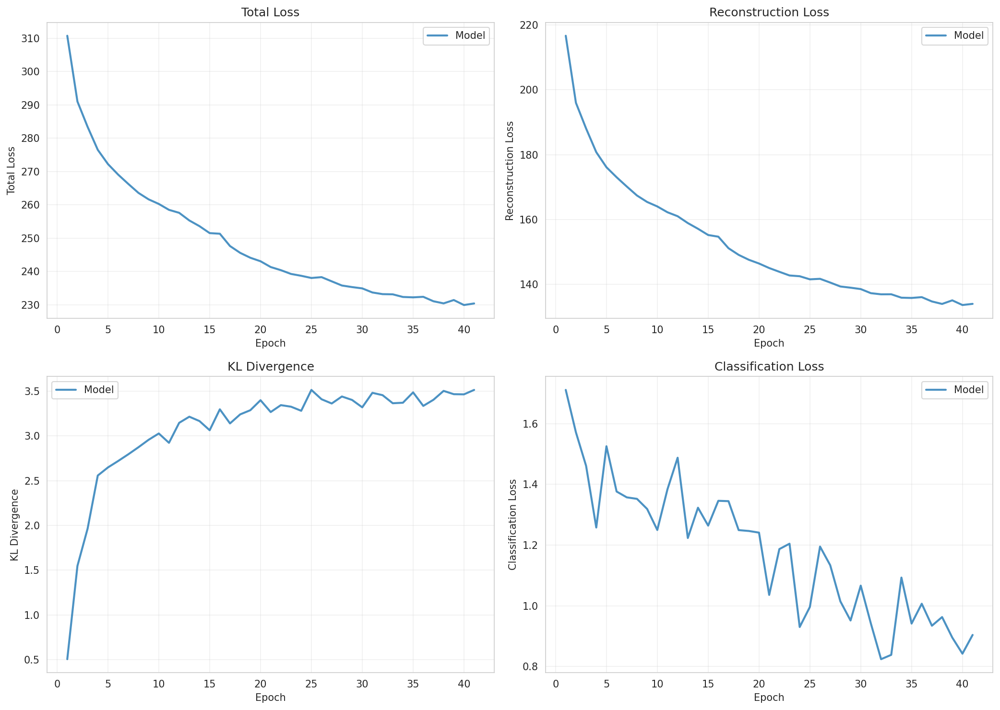
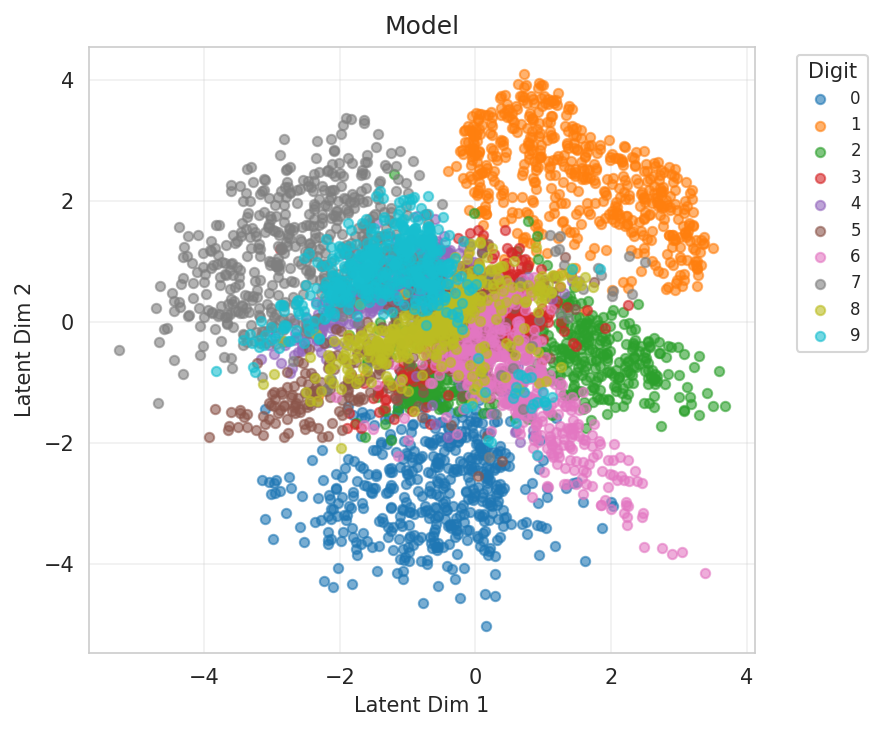
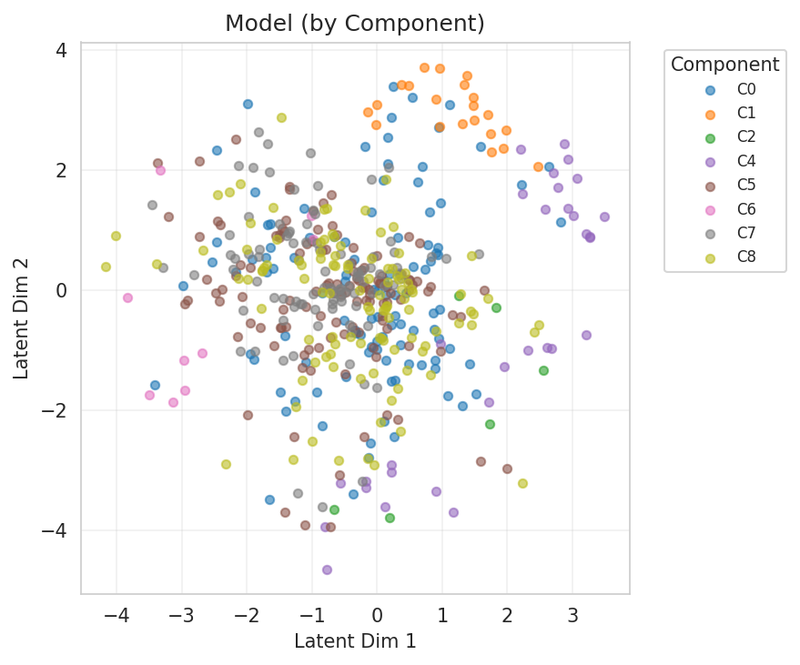
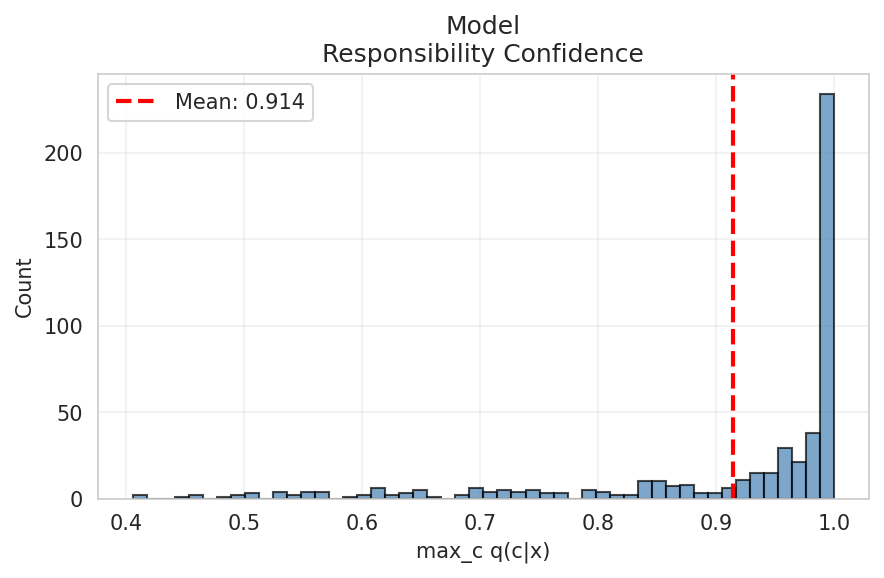
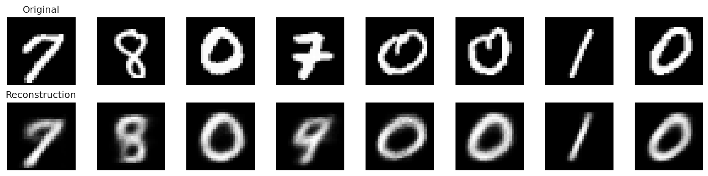
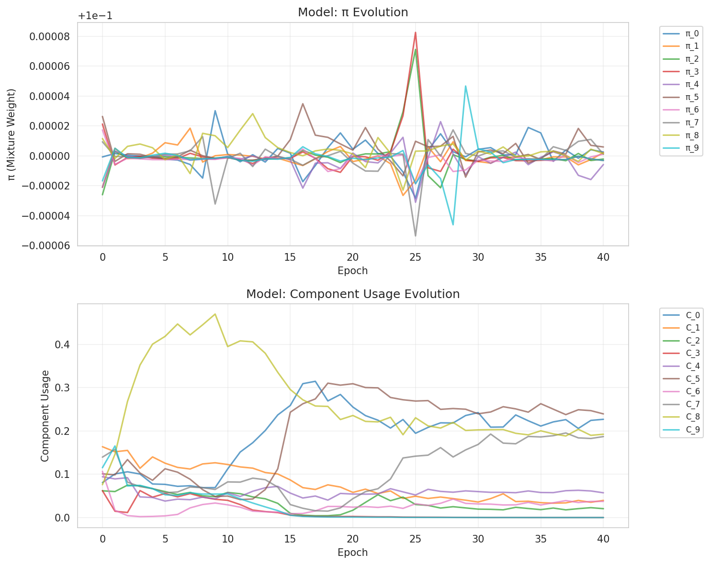
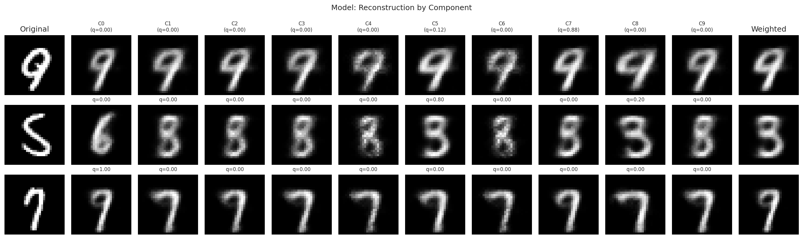
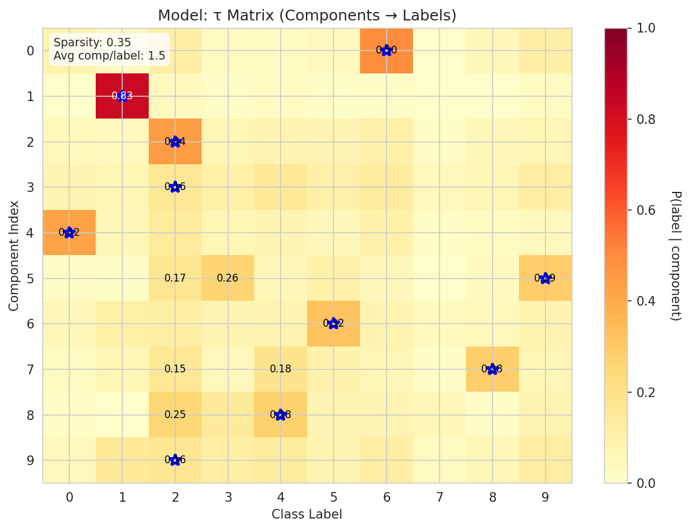
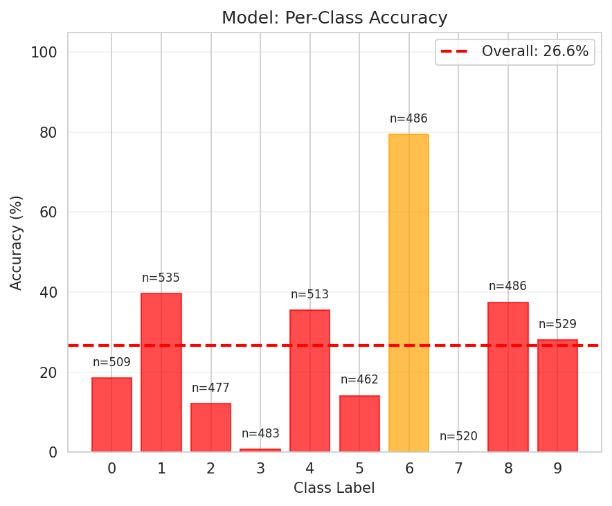
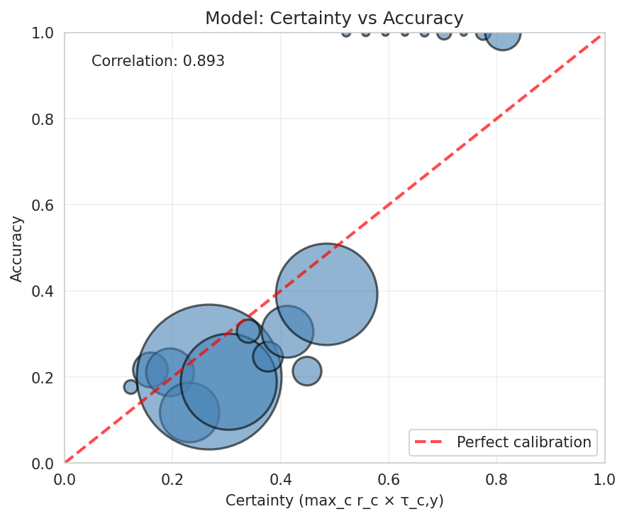

# Experiment Report

**Experiment:** tau_classifier_validation

**Description:** Validate τ-classifier with component-aware decoder (recovery experiment)

**Tags:** tau, validation, recovery, 2d-latent

**Generated:** 20251110_023044

## Configuration

### Data

- num_samples: 5000
- num_labeled: 50
- seed: 42

### Model

- Prior: mixture
- Latent dim: 2
- Hidden dims: (256, 128, 64)
- Components (K): 10
- Reconstruction loss: bce
- Learning rate: 0.001
- Batch size: 128
- Max epochs: 50

## Results

### Summary Metrics

| Category | Metric | Value |
|----------|--------|-------|
| Training | Loss | 230.3669 |
| Training | Recon Loss | 134.0226 |
| Training | Kl Z | 3.5129 |
| Training | Kl C | 0.0021 |
| Training | Training Time Sec | 221.7180 |
| Training | Epochs Completed | 41 |
| Classification | Accuracy | 0.2660 |
| Classification | Classification Loss | 0.9041 |
| Mixture | K | 10 |
| Mixture | Component Entropy | 0.1972 |
| Mixture | Pi Entropy | 2.3026 |
| Mixture | K Eff | 5.8736 |
| Mixture | Active Components | 8 |
| Mixture | Responsibility Confidence Mean | 0.9142 |
| Mixture | Component Majority Labels | [6, 1, 0, 1, 8, 8, 1, 1, 9, 1] |
| Mixture | Component Majority Confidence | [0.33365410566329956, 0.9999678730964661, 0.7277593612670898, 0.6717520356178284, 0.7293590903282166, 0.9906355142593384, 0.8299670219421387, 0.9380892515182495, 0.47961845993995667, 0.9603657722473145] |
| Mixture | Pi Max | 0.1000 |
| Mixture | Pi Min | 0.1000 |
| Mixture | Pi Argmax | 5 |
| Clustering | NMI | 0.7216 |
| Clustering | ARI | 0.0000 |
| τ-Classifier | Tau Matrix Shape | [10, 10] |
| τ-Classifier | Tau Sparsity | 0.3500 |
| τ-Classifier | Avg Components Per Label | 1.5000 |
| τ-Classifier | Label Coverage | 9 |
| τ-Classifier | Certainty Mean | 0.3399 |
| τ-Classifier | Certainty Std | 0.1287 |
| τ-Classifier | Certainty Min | 0.1045 |
| τ-Classifier | Certainty Max | 0.8294 |
| τ-Classifier | Ood Score Mean | 0.6601 |
| τ-Classifier | Ood Score Std | 0.1287 |
| τ-Classifier | Num Free Channels | 10 |

## Visualizations

### Loss Curves

### Latent Space

**By Class Label:**

**By Component Assignment:**

### Responsibility Confidence

Distribution of max_c q(c|x):

### Reconstructions

### Mixture Evolution

### Component Embedding Divergence

Pairwise distances between learned component embeddings:

### Reconstruction by Component

How each component reconstructs individual inputs:

### τ Matrix (Component → Label Mapping)

Learned probability distribution showing which components are associated with which labels:

### Per-Class Accuracy

Breakdown of classification accuracy by class:

### Certainty Calibration

Relationship between model certainty and actual accuracy:

