# Experiment Report

**Experiment:** tau_classifier_validation

**Description:** Validate τ-classifier with component-aware decoder (recovery experiment)

**Tags:** tau, validation, recovery, 2d-latent

**Generated:** 20251110_112521

## Configuration

### Data

- num_samples: 5000
- num_labeled: 500
- seed: 42

### Model

- Prior: mixture
- Latent dim: 2
- Hidden dims: (256, 128, 64)
- Components (K): 10
- Reconstruction loss: bce
- Learning rate: 0.001
- Batch size: 128
- Max epochs: 50

## Results

### Summary Metrics

| Category | Metric | Value |
|----------|--------|-------|
| Training | Loss | 229.5327 |
| Training | Recon Loss | 132.2837 |
| Training | Kl Z | 3.4744 |
| Training | Kl C | 0.0021 |
| Training | Training Time Sec | 354.8747 |
| Training | Epochs Completed | 50 |
| Classification | Accuracy | 0.3298 |
| Classification | Classification Loss | 1.8576 |
| Mixture | K | 10 |
| Mixture | Component Entropy | 0.2316 |
| Mixture | Pi Entropy | 2.3026 |
| Mixture | K Eff | 6.5945 |
| Mixture | Active Components | 9 |
| Mixture | Responsibility Confidence Mean | 0.8911 |
| Mixture | Component Majority Labels | [0, 1, 0, 7, 4, 3, 7, 6, 7, 8] |
| Mixture | Component Majority Confidence | [0.7518320679664612, 0.9993535280227661, 0.20763450860977173, 0.279020220041275, 0.5527974963188171, 0.2871473729610443, 0.6154484748840332, 0.4552935063838959, 0.22344936430454254, 0.1947993040084839] |
| Mixture | Pi Max | 0.1000 |
| Mixture | Pi Min | 0.1000 |
| Mixture | Pi Argmax | 9 |
| Clustering | NMI | 0.3138 |
| Clustering | ARI | 0.0268 |
| τ-Classifier | Tau Matrix Shape | [10, 10] |
| τ-Classifier | Tau Sparsity | 0.2600 |
| τ-Classifier | Avg Components Per Label | 1.1000 |
| τ-Classifier | Label Coverage | 7 |
| τ-Classifier | Certainty Mean | 0.2399 |
| τ-Classifier | Certainty Std | 0.1574 |
| τ-Classifier | Certainty Min | 0.0561 |
| τ-Classifier | Certainty Max | 0.7510 |
| τ-Classifier | Ood Score Mean | 0.7601 |
| τ-Classifier | Ood Score Std | 0.1574 |
| τ-Classifier | Num Free Channels | 10 |

## Visualizations

### Loss Curves

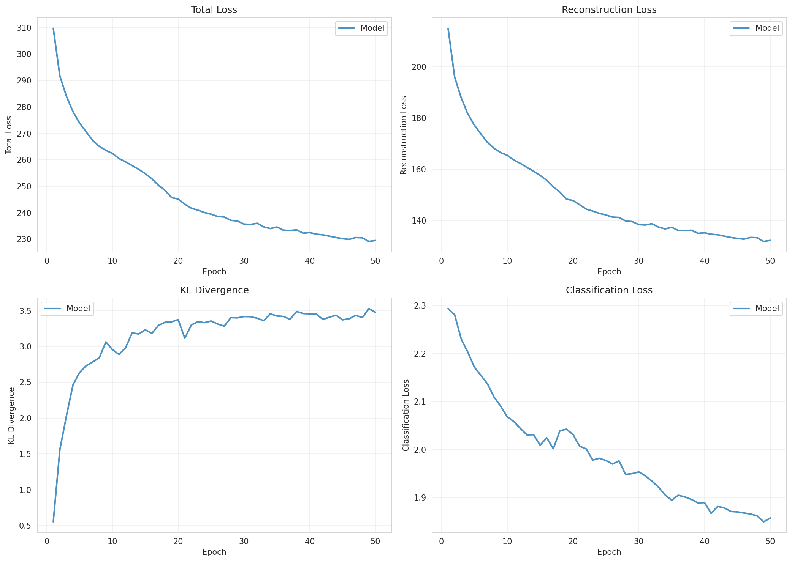

### Latent Space

**By Class Label:**

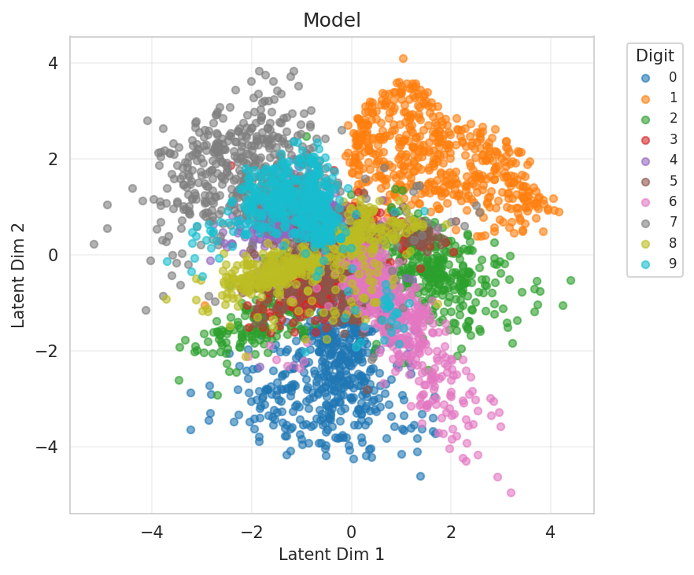

**By Component Assignment:**

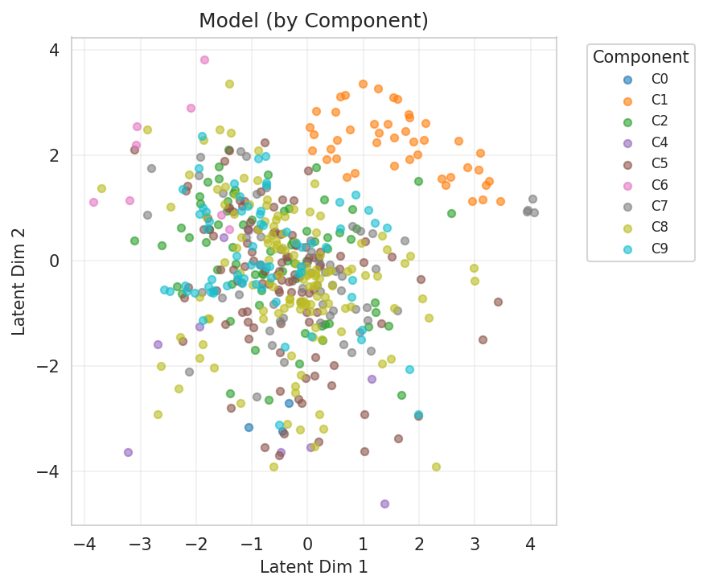

### Responsibility Confidence

Distribution of max_c q(c|x):

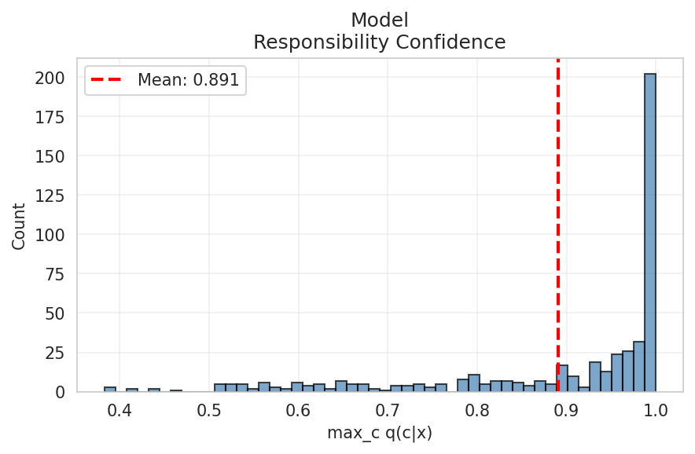

### Reconstructions

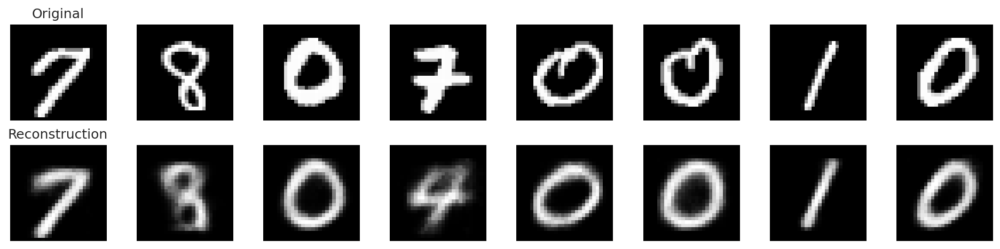

### Mixture Evolution

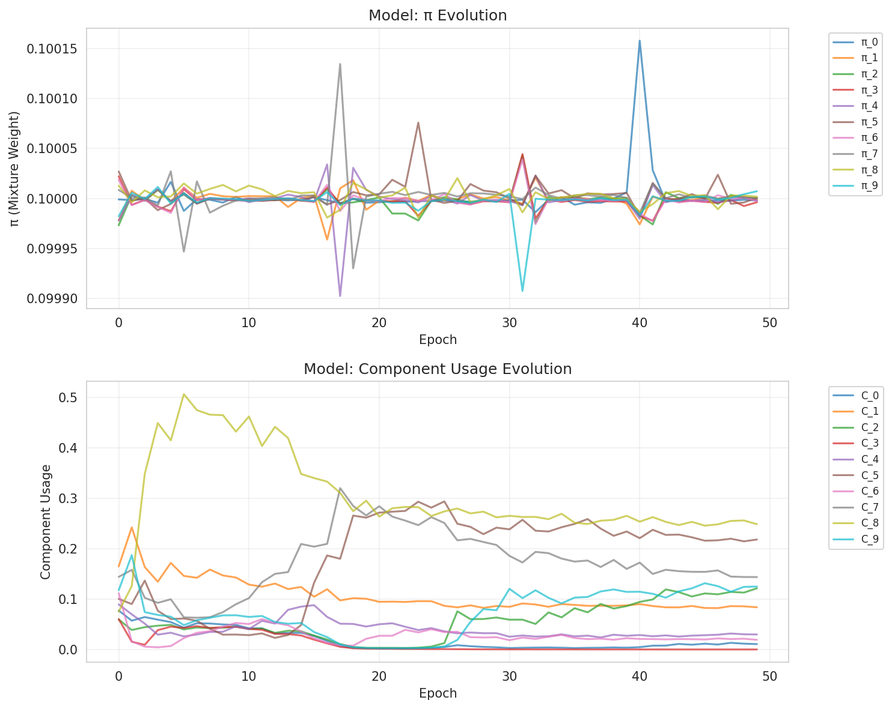

### Component Embedding Divergence

Pairwise distances between learned component embeddings:

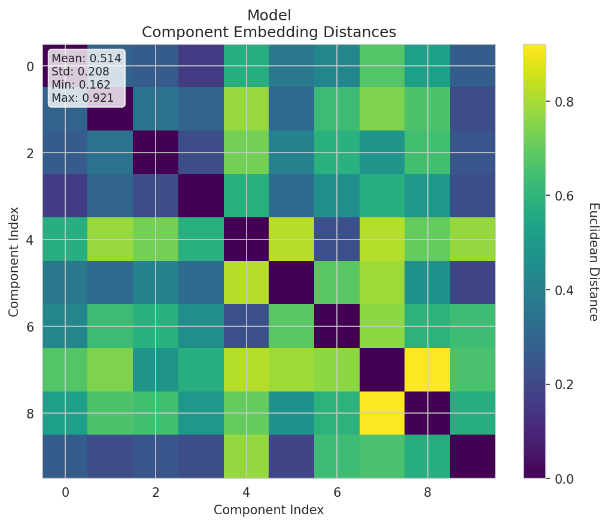

### Reconstruction by Component

How each component reconstructs individual inputs:

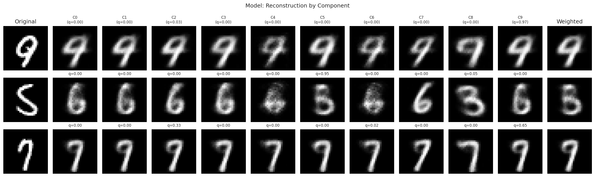

### τ Matrix (Component → Label Mapping)

Learned probability distribution showing which components are associated with which labels:

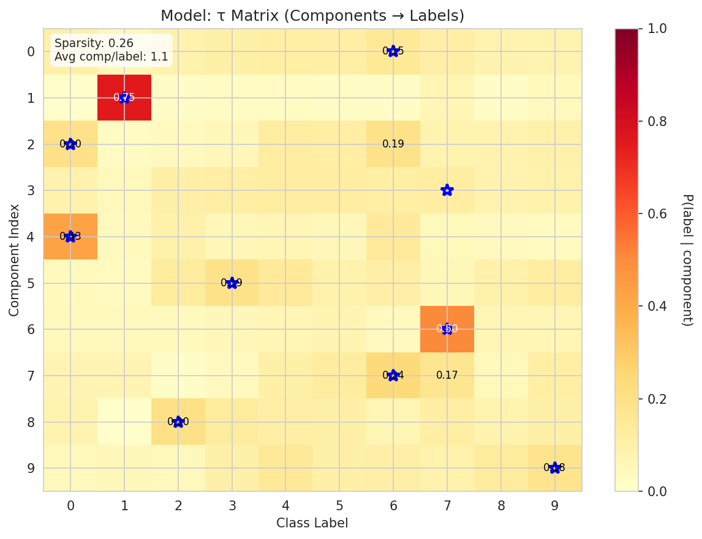

### Per-Class Accuracy

Breakdown of classification accuracy by class:

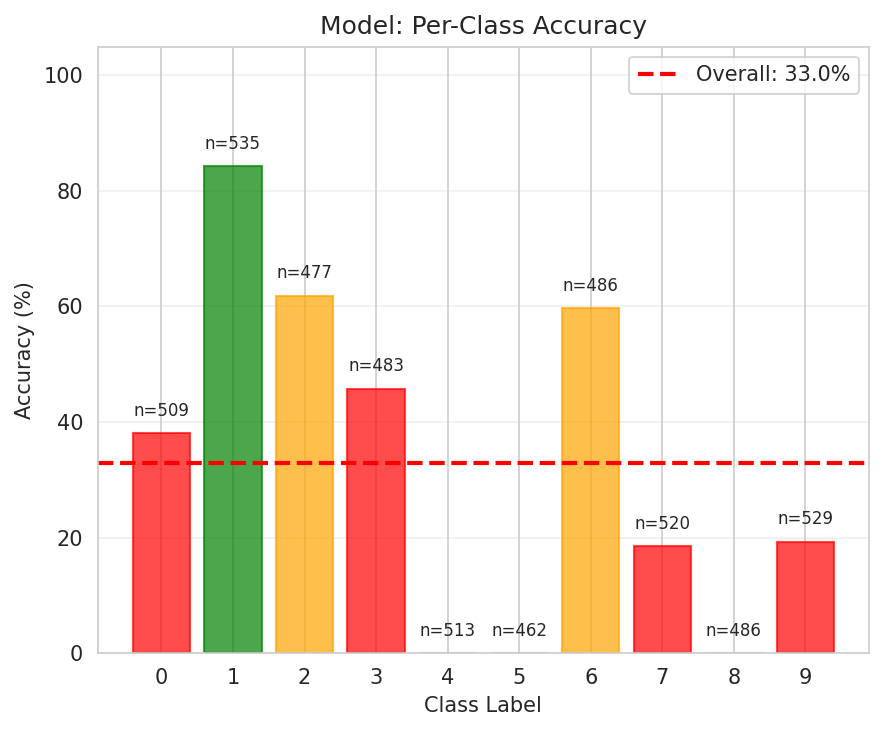

### Certainty Calibration

Relationship between model certainty and actual accuracy:

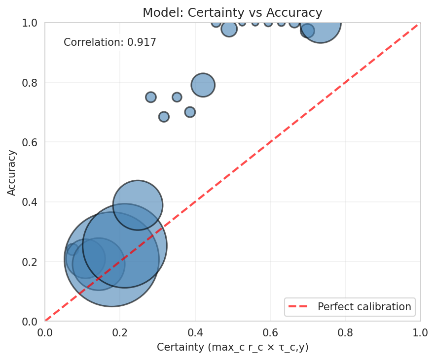

