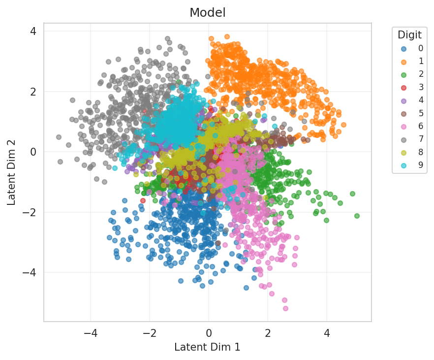
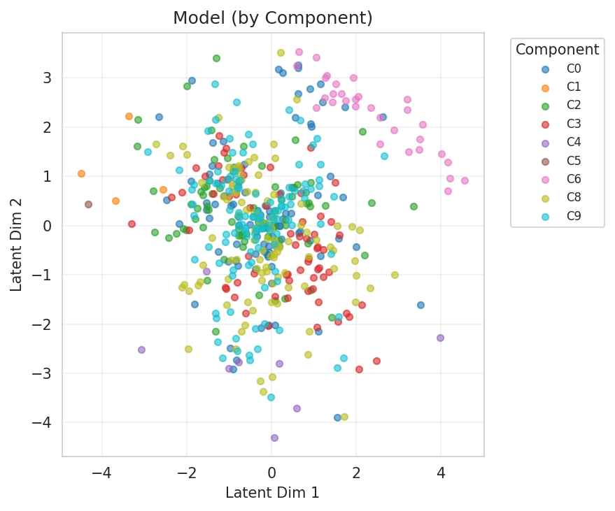
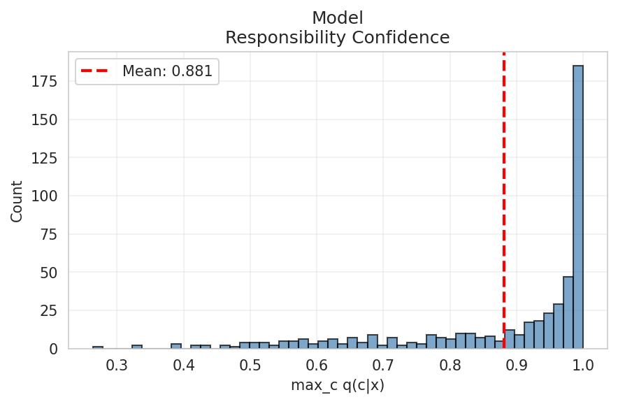
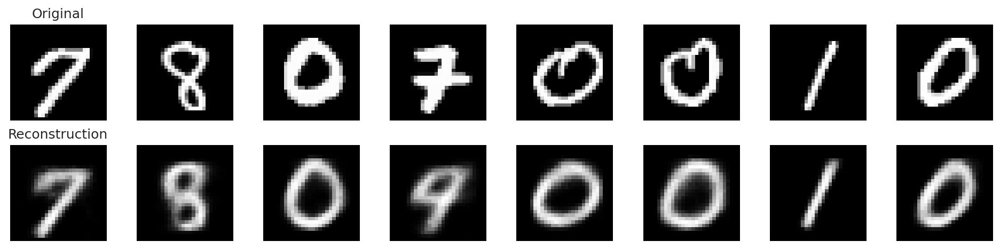
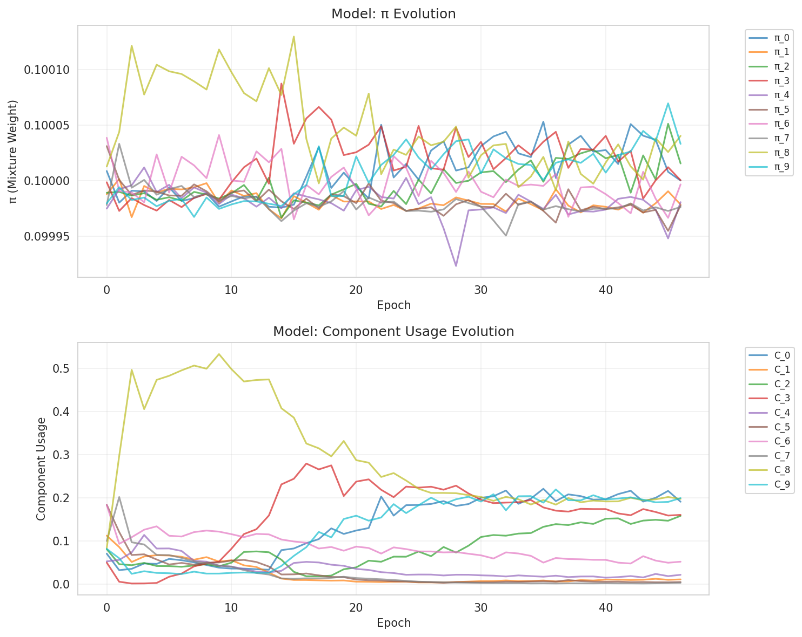
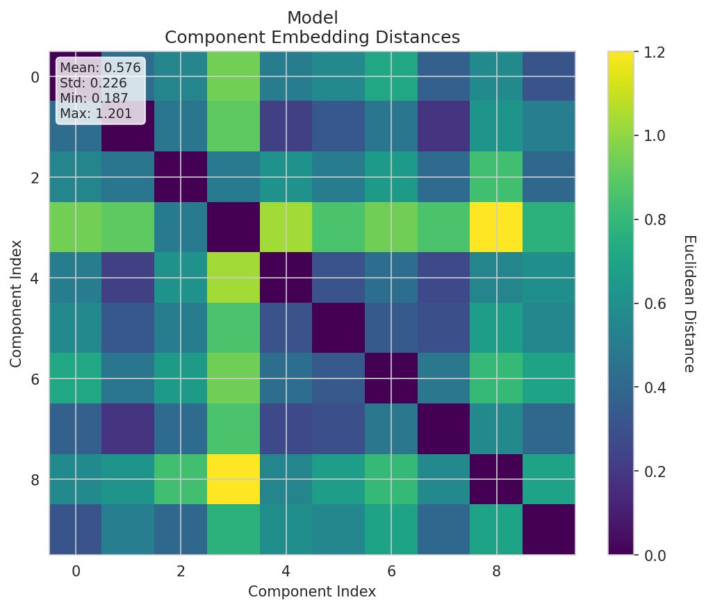
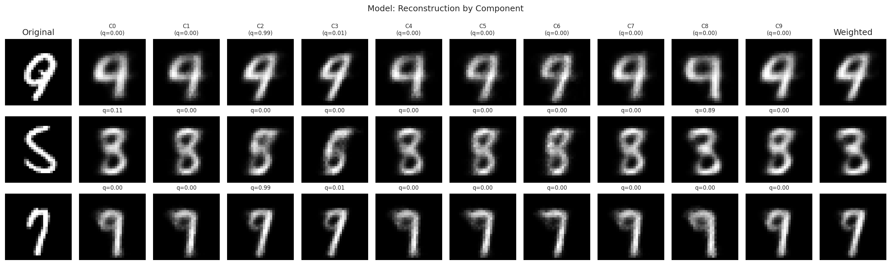
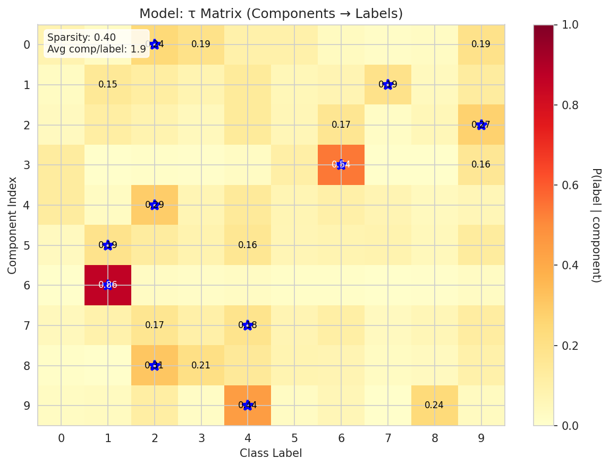
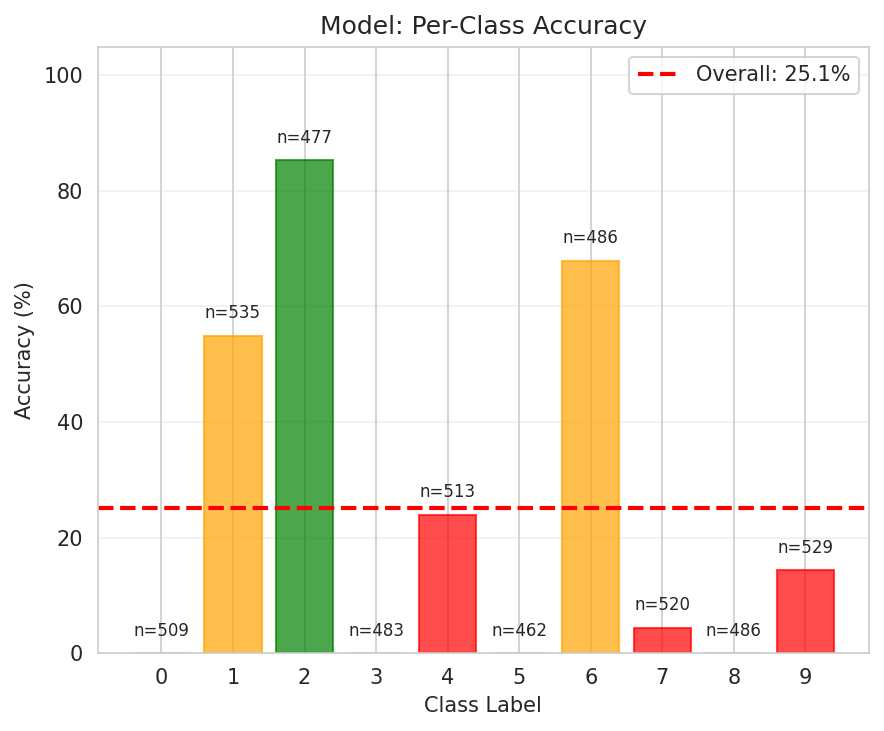
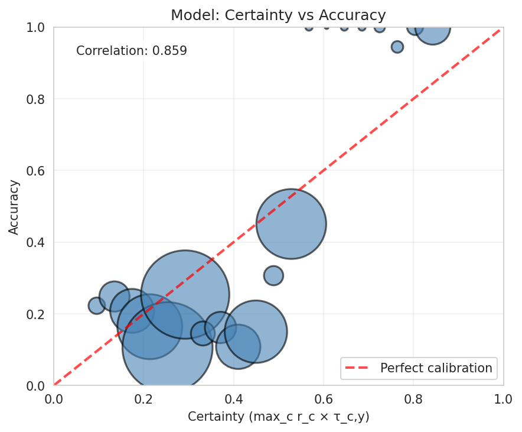

# Experiment Report

**Experiment:** tau_classifier_validation

**Description:** Validate τ-classifier with component-aware decoder (recovery experiment)

**Tags:** tau, validation, recovery, 2d-latent

**Generated:** 20251110_114225

## Configuration

### Data

- num_samples: 5000
- num_labeled: 50
- seed: 42

### Model

- Prior: mixture
- Latent dim: 2
- Hidden dims: (256, 128, 64)
- Components (K): 10
- Reconstruction loss: bce
- Learning rate: 0.001
- Batch size: 128
- Max epochs: 50

## Results

### Summary Metrics

| Category | Metric | Value |
|----------|--------|-------|
| Training | Loss | 228.7984 |
| Training | Recon Loss | 132.5151 |
| Training | Kl Z | 3.4486 |
| Training | Kl C | 0.0204 |
| Training | Training Time Sec | 256.2012 |
| Training | Epochs Completed | 47 |
| Classification | Accuracy | 0.2506 |
| Classification | Classification Loss | 0.8965 |
| Mixture | K | 10 |
| Mixture | Component Entropy | 0.2613 |
| Mixture | Pi Entropy | 2.3026 |
| Mixture | K Eff | 6.5135 |
| Mixture | Active Components | 8 |
| Mixture | Responsibility Confidence Mean | 0.8812 |
| Mixture | Component Majority Labels | [8, 8, 1, 6, 8, 1, 1, 8, 9, 1] |
| Mixture | Component Majority Confidence | [0.9986529350280762, 0.9955613613128662, 0.9885062575340271, 0.5010352730751038, 0.9930544495582581, 0.5202449560165405, 0.9999930262565613, 0.9258652925491333, 0.5003039240837097, 0.9545530080795288] |
| Mixture | Pi Max | 0.1000 |
| Mixture | Pi Min | 0.1000 |
| Mixture | Pi Argmax | 8 |
| Clustering | NMI | 0.8520 |
| Clustering | ARI | 0.0000 |
| τ-Classifier | Tau Matrix Shape | [10, 10] |
| τ-Classifier | Tau Sparsity | 0.4000 |
| τ-Classifier | Avg Components Per Label | 1.9000 |
| τ-Classifier | Label Coverage | 8 |
| τ-Classifier | Certainty Mean | 0.3509 |
| τ-Classifier | Certainty Std | 0.1567 |
| τ-Classifier | Certainty Min | 0.0758 |
| τ-Classifier | Certainty Max | 0.8622 |
| τ-Classifier | Ood Score Mean | 0.6491 |
| τ-Classifier | Ood Score Std | 0.1567 |
| τ-Classifier | Num Free Channels | 10 |

## Visualizations

### Loss Curves

### Latent Space

**By Class Label:**

**By Component Assignment:**

### Responsibility Confidence

Distribution of max_c q(c|x):

### Reconstructions

### Mixture Evolution

### Component Embedding Divergence

Pairwise distances between learned component embeddings:

### Reconstruction by Component

How each component reconstructs individual inputs:

### τ Matrix (Component → Label Mapping)

Learned probability distribution showing which components are associated with which labels:

### Per-Class Accuracy

Breakdown of classification accuracy by class:

### Certainty Calibration

Relationship between model certainty and actual accuracy:

