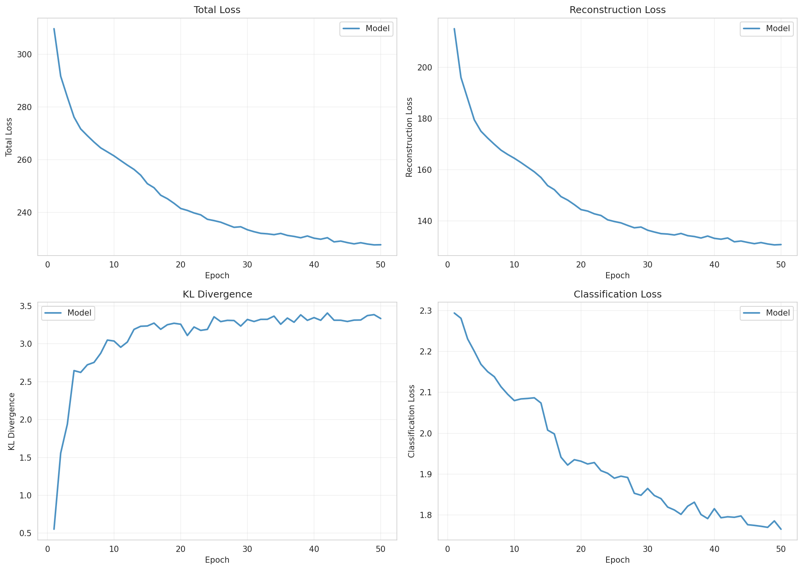
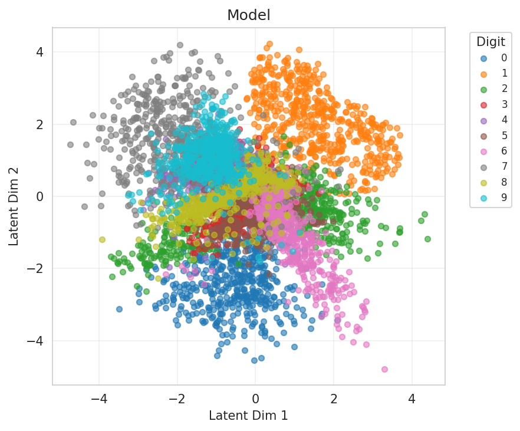
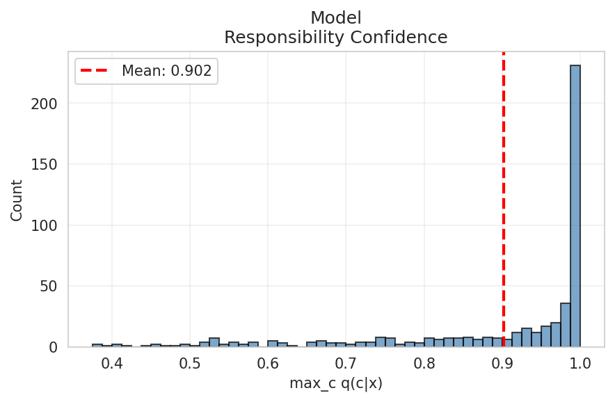
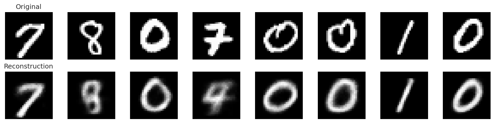
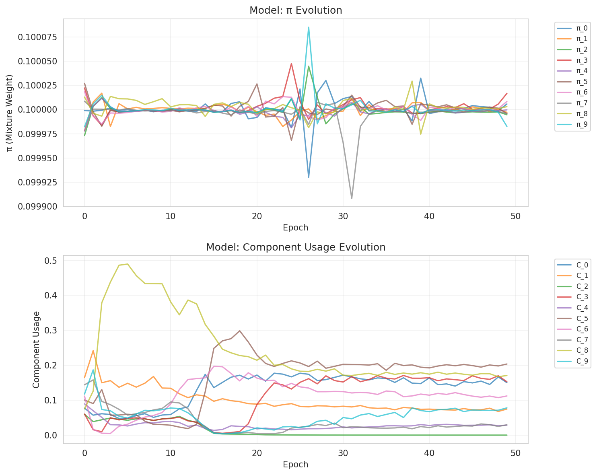
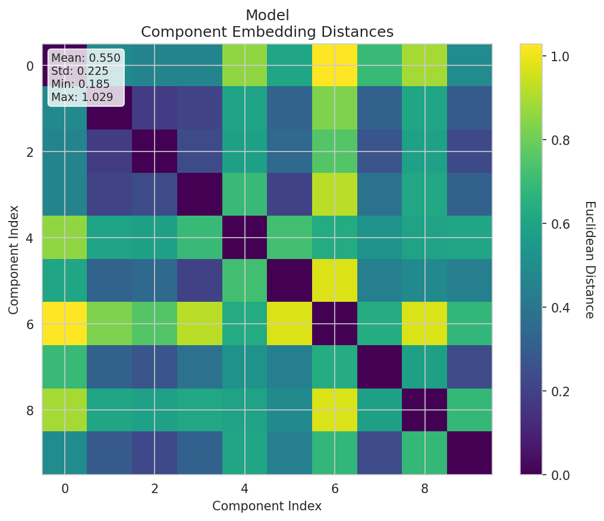
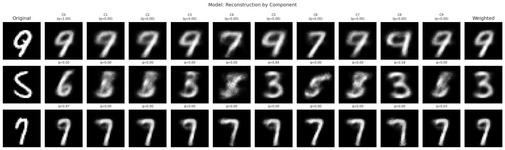
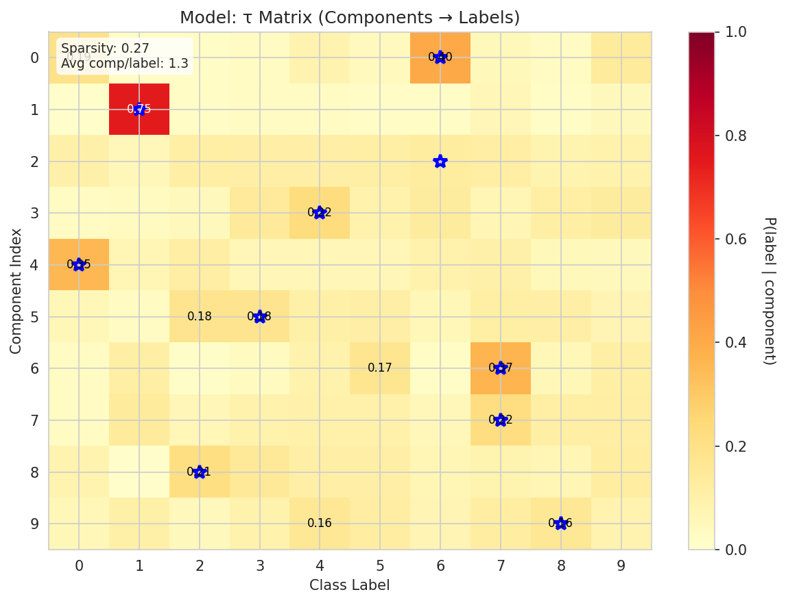
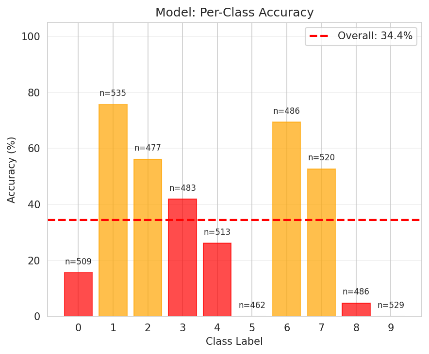
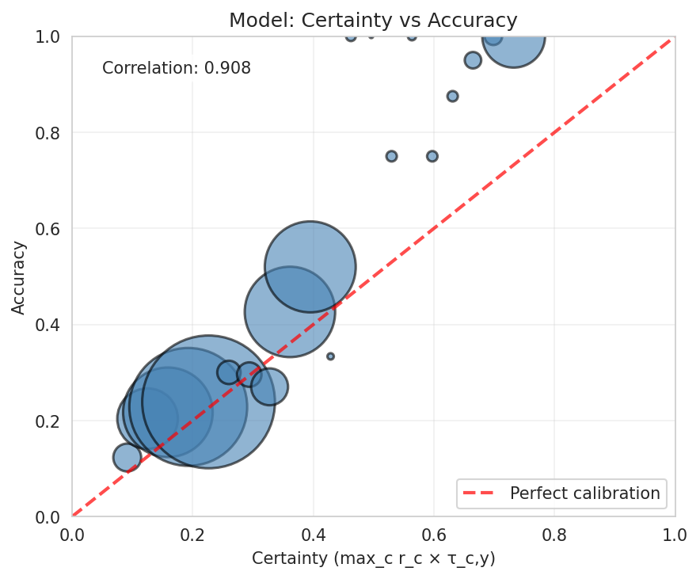

# Experiment Report

**Experiment:** tau_classifier_validation

**Description:** Validate τ-classifier with component-aware decoder (recovery experiment)

**Tags:** tau, validation, recovery, 2d-latent

**Generated:** 20251110_114715

## Configuration

### Data

- num_samples: 5000
- num_labeled: 500
- seed: 42

### Model

- Prior: mixture
- Latent dim: 2
- Hidden dims: (256, 128, 64)
- Components (K): 10
- Reconstruction loss: bce
- Learning rate: 0.001
- Batch size: 128
- Max epochs: 50

## Results

### Summary Metrics

| Category | Metric | Value |
|----------|--------|-------|
| Training | Loss | 227.7813 |
| Training | Recon Loss | 130.7790 |
| Training | Kl Z | 3.3324 |
| Training | Kl C | 0.0021 |
| Training | Training Time Sec | 359.9431 |
| Training | Epochs Completed | 50 |
| Classification | Accuracy | 0.3444 |
| Classification | Classification Loss | 1.7656 |
| Mixture | K | 10 |
| Mixture | Component Entropy | 0.1683 |
| Mixture | Pi Entropy | 2.3026 |
| Mixture | K Eff | 7.8527 |
| Mixture | Active Components | 9 |
| Mixture | Responsibility Confidence Mean | 0.9017 |
| Mixture | Component Majority Labels | [6, 1, 0, 8, 0, 2, 7, 7, 3, 8] |
| Mixture | Component Majority Confidence | [0.33935093879699707, 0.802844762802124, 0.3847845494747162, 0.3075293302536011, 0.8061041235923767, 0.3104284405708313, 0.32176485657691956, 0.4727960526943207, 0.17975588142871857, 0.4396546483039856] |
| Mixture | Pi Max | 0.1000 |
| Mixture | Pi Min | 0.1000 |
| Mixture | Pi Argmax | 3 |
| Clustering | NMI | 0.3693 |
| Clustering | ARI | 0.0697 |
| τ-Classifier | Tau Matrix Shape | [10, 10] |
| τ-Classifier | Tau Sparsity | 0.2700 |
| τ-Classifier | Avg Components Per Label | 1.3000 |
| τ-Classifier | Label Coverage | 9 |
| τ-Classifier | Certainty Mean | 0.2777 |
| τ-Classifier | Certainty Std | 0.1534 |
| τ-Classifier | Certainty Min | 0.0744 |
| τ-Classifier | Certainty Max | 0.7489 |
| τ-Classifier | Ood Score Mean | 0.7223 |
| τ-Classifier | Ood Score Std | 0.1534 |
| τ-Classifier | Num Free Channels | 10 |

## Visualizations

### Loss Curves

### Latent Space

**By Class Label:**

**By Component Assignment:**

### Responsibility Confidence

Distribution of max_c q(c|x):

### Reconstructions

### Mixture Evolution

### Component Embedding Divergence

Pairwise distances between learned component embeddings:

### Reconstruction by Component

How each component reconstructs individual inputs:

### τ Matrix (Component → Label Mapping)

Learned probability distribution showing which components are associated with which labels:

### Per-Class Accuracy

Breakdown of classification accuracy by class:

### Certainty Calibration

Relationship between model certainty and actual accuracy:

