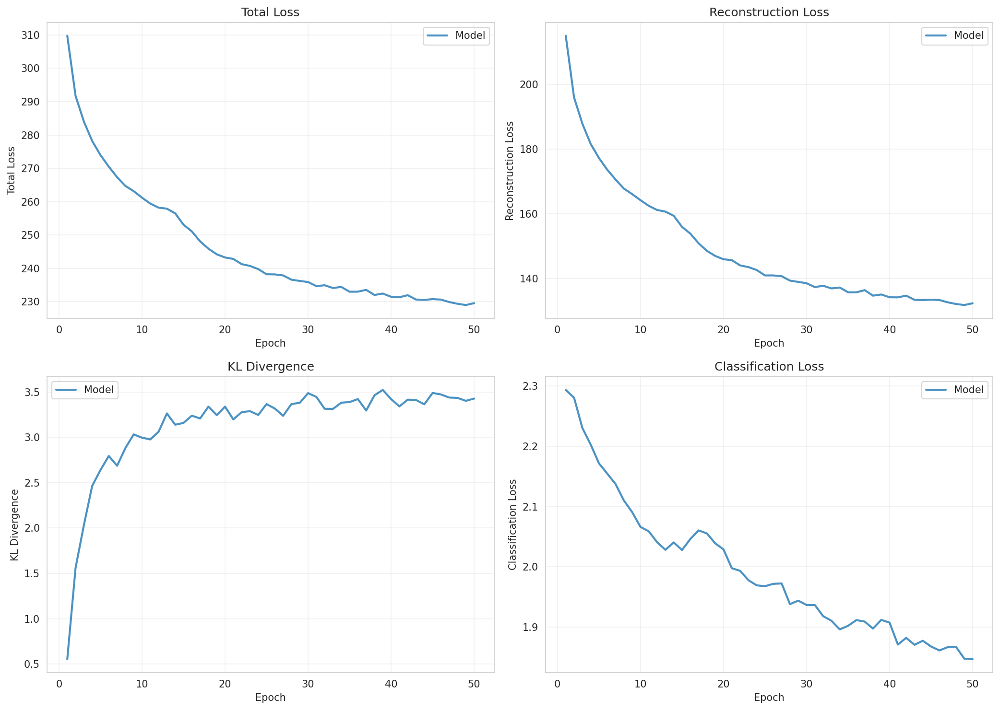
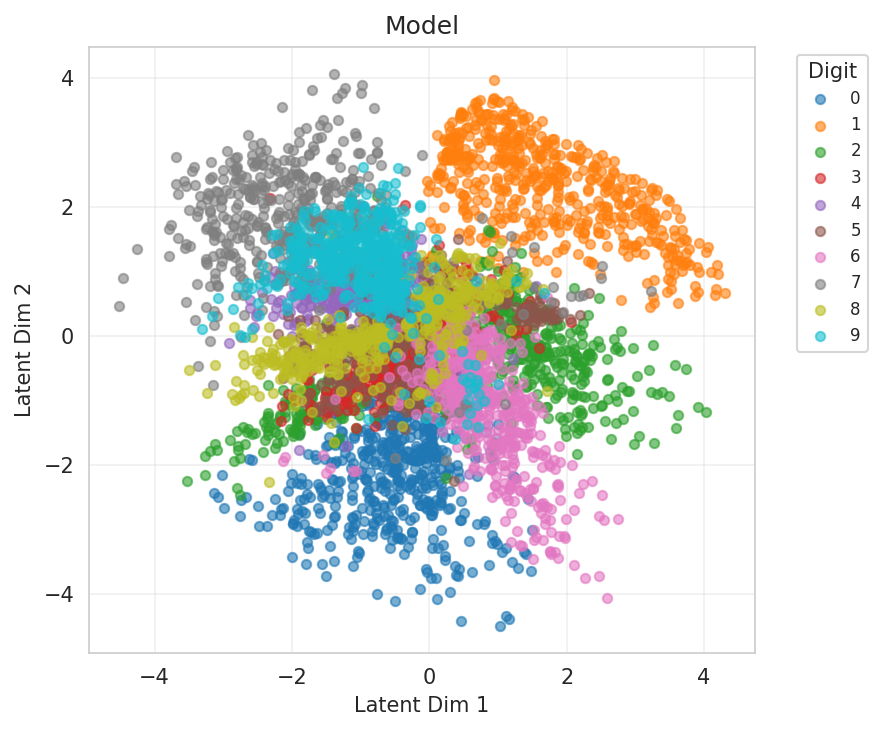
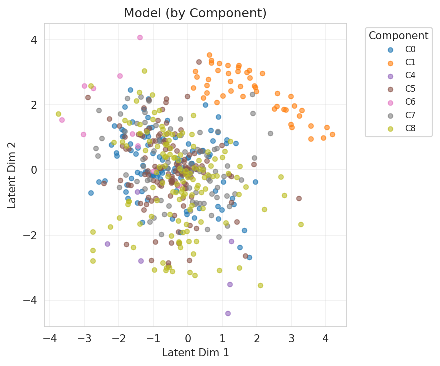
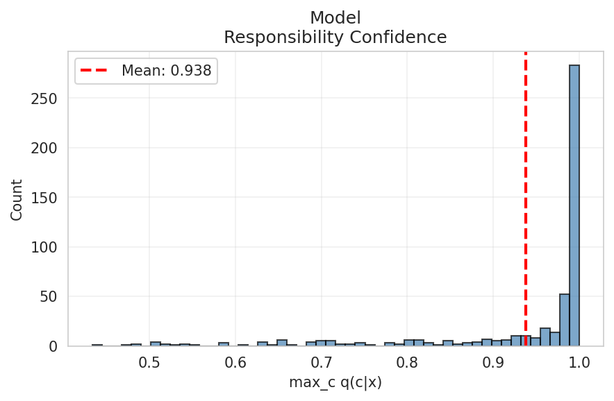
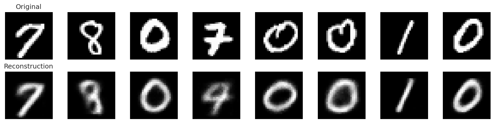
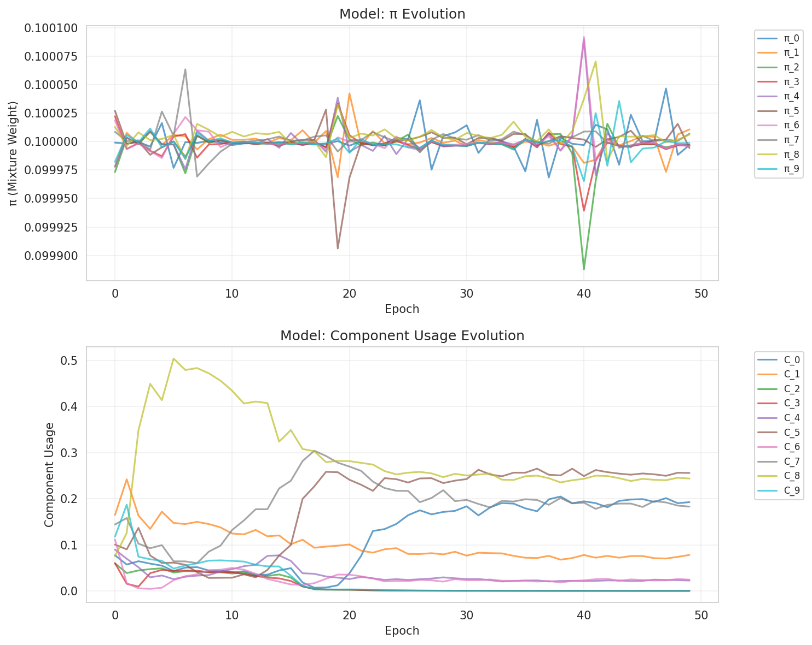
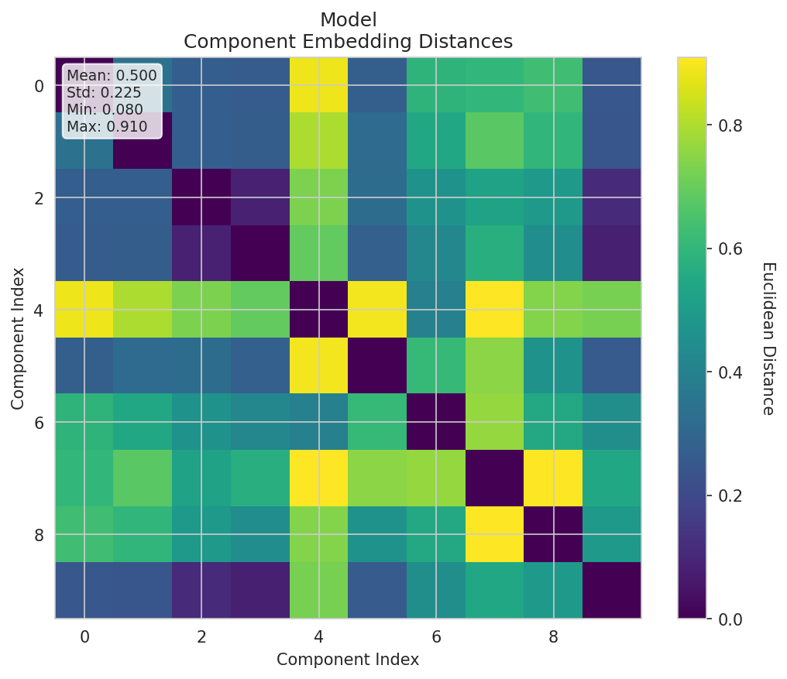
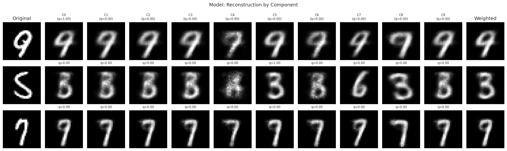
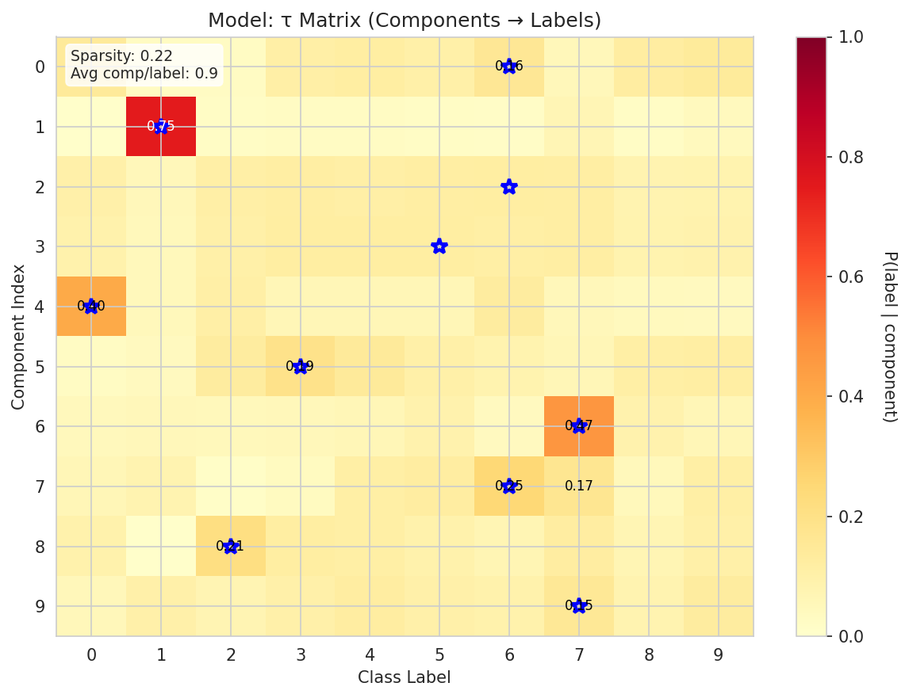
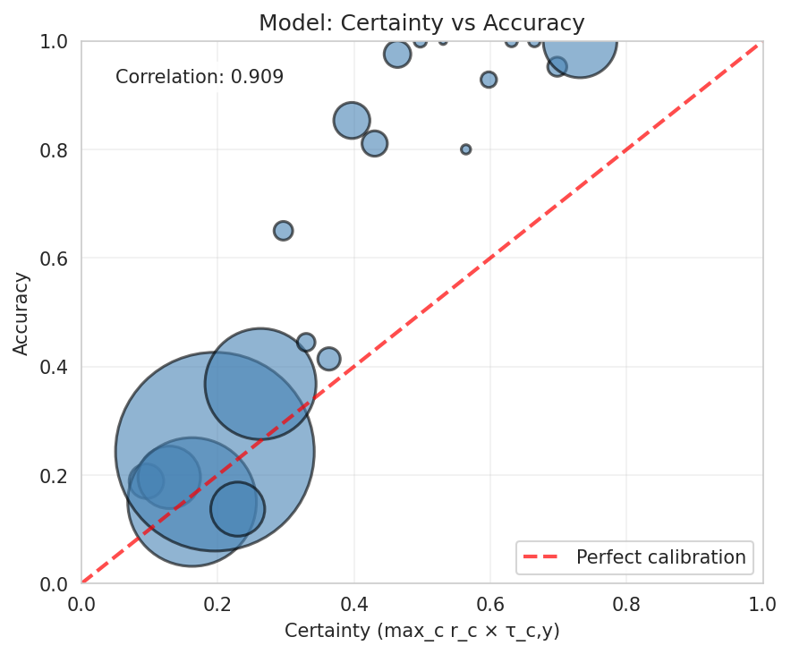

# Experiment Report

**Experiment:** tau_classifier_validation

**Description:** Validate τ-classifier with component-aware decoder (recovery experiment)

**Tags:** tau, validation, recovery, 2d-latent

**Generated:** 20251110_133831

## Configuration

### Data

- num_samples: 5000
- num_labeled: 500
- seed: 42

### Model

- Prior: mixture
- Latent dim: 2
- Hidden dims: (256, 128, 64)
- Components (K): 10
- Reconstruction loss: bce
- Learning rate: 0.001
- Batch size: 128
- Max epochs: 50

## Results

### Summary Metrics

| Category | Metric | Value |
|----------|--------|-------|
| Training | Loss | 229.5875 |
| Training | Recon Loss | 132.3774 |
| Training | Kl Z | 3.4257 |
| Training | Kl C | 0.0022 |
| Training | Training Time Sec | 110.1885 |
| Training | Epochs Completed | 50 |
| Classification | Accuracy | 0.3164 |
| Classification | Classification Loss | 1.8464 |
| Mixture | K | 10 |
| Mixture | Component Entropy | 0.1201 |
| Mixture | Pi Entropy | 2.3026 |
| Mixture | K Eff | 5.2857 |
| Mixture | Active Components | 7 |
| Mixture | Responsibility Confidence Mean | 0.9379 |
| Mixture | Component Majority Labels | [5, 1, 8, 8, 0, 3, 7, 6, 7, 8] |
| Mixture | Component Majority Confidence | [0.22542260587215424, 0.9990032911300659, 0.5248777270317078, 0.36706870794296265, 0.9532599449157715, 0.3207170069217682, 0.7465587854385376, 0.3724459409713745, 0.22354942560195923, 0.41780656576156616] |
| Mixture | Pi Max | 0.1000 |
| Mixture | Pi Min | 0.1000 |
| Mixture | Pi Argmax | 1 |
| Clustering | NMI | 0.3074 |
| Clustering | ARI | 0.0445 |
| τ-Classifier | Tau Matrix Shape | [10, 10] |
| τ-Classifier | Tau Sparsity | 0.2200 |
| τ-Classifier | Avg Components Per Label | 0.9000 |
| τ-Classifier | Label Coverage | 6 |
| τ-Classifier | Certainty Mean | 0.2442 |
| τ-Classifier | Certainty Std | 0.1483 |
| τ-Classifier | Certainty Min | 0.0784 |
| τ-Classifier | Certainty Max | 0.7483 |
| τ-Classifier | Ood Score Mean | 0.7558 |
| τ-Classifier | Ood Score Std | 0.1483 |
| τ-Classifier | Num Free Channels | 10 |

## Visualizations

### Loss Curves

### Latent Space

**By Class Label:**

**By Component Assignment:**

### Responsibility Confidence

Distribution of max_c q(c|x):

### Reconstructions

### Mixture Evolution

### Component Embedding Divergence

Pairwise distances between learned component embeddings:

### Reconstruction by Component

How each component reconstructs individual inputs:

### τ Matrix (Component → Label Mapping)

Learned probability distribution showing which components are associated with which labels:

### Per-Class Accuracy

Breakdown of classification accuracy by class:

### Certainty Calibration

Relationship between model certainty and actual accuracy:

